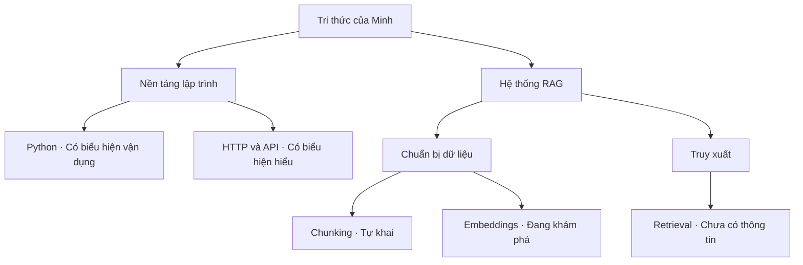
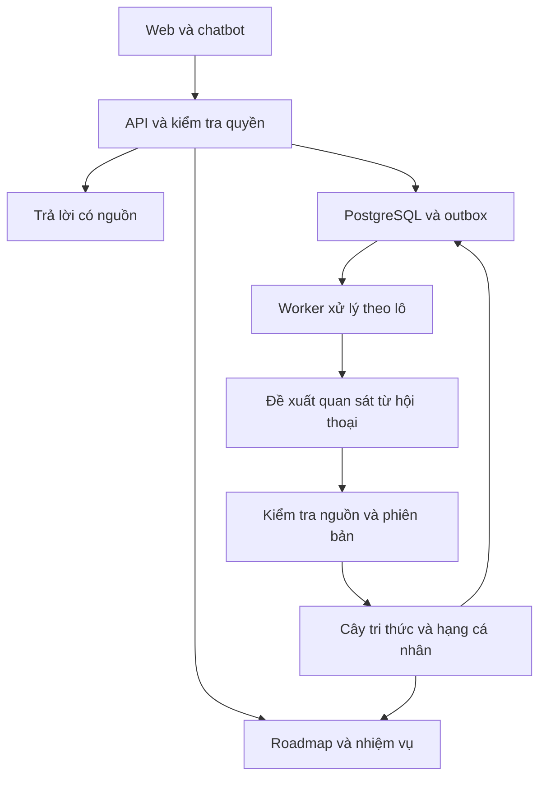

# LifeOS Đặc tả nghiệp vụ và triển khai ứng dụng

Phiên bản 5.0 • Ngày 25 tháng 09 năm 2026

## Cách sử dụng tài liệu

LifeOS là ứng dụng học tập được game hóa, có chatbot đồng hành, cây tri thức phân nhánh, lộ trình thích ứng và nhiệm vụ gắn với mục tiêu cá nhân. Tài liệu dành cho chủ sản phẩm, người thiết kế giao diện, lập trình viên, người kiểm thử và coding agent. Bản Word và Markdown cùng phiên bản mô tả cùng một nghiệp vụ; dùng Markdown làm đầu vào triển khai.

Vòng lặp bản đầu là xác định mục tiêu, khai báo nền tảng, chọn lộ trình, học và trò chuyện tự nhiên, thực hiện nhiệm vụ, quan sát tiến bộ, điều chỉnh kế hoạch rồi tự xác nhận hoàn thành hành trình. Hệ thống suy luận biểu hiện hiểu biết từ hội thoại và luôn lưu căn cứ. Không tổ chức bài thi, không chấm bài để lên hạng, không có Stamina và không có bảng xếp hạng cộng đồng trong bản đầu.

Hạng phát triển theo từng lĩnh vực được tích lũy và không giảm vì nghỉ học. Người chơi xác nhận hoàn thành chặng và mục tiêu; hệ thống chỉ đề xuất hành trình tiếp theo, không tự kích hoạt. XP ghi nhận hoạt động, hạng ghi nhận biểu hiện tư duy, cây tri thức mô tả từng phần kiến thức. Ba loại tiến bộ có dữ liệu và luật riêng.

Các tên bậc, ngưỡng quan sát, giới hạn thời gian và hạn mức tại mục 16 là cấu hình khởi đầu đề xuất để triển khai và hiệu chỉnh. Chúng không phải thang đo năng lực đã được kiểm định. Quy tắc cốt lõi đã chốt được trình bày tại mục 7; các cấu hình không được làm thay đổi những quy tắc đó.

Đợt A là phạm vi nghiệm thu. B và C là hướng mở rộng, không giao coding agent tự xây khi chưa có đặc tả tiếp theo. Thứ tự ưu tiên là quy tắc nghiệp vụ, hợp đồng dữ liệu và API, tình huống nghiệm thu, rồi ví dụ. Ghi quyết định triển khai vào DECISIONS.md; không âm thầm giải quyết mâu thuẫn bằng cách phục hồi luật cũ.

## 1 Ý tưởng cốt lõi và định vị sản phẩm

### 1.1 Kết quả mong muốn

Người học biết mình đã trao đổi và thể hiện hiểu biết ở phần nào, hôm nay nên học gì, và vì sao lộ trình thay đổi. Việc học diễn ra qua tài liệu miễn phí được lựa chọn, thực hành và trò chuyện với người đồng hành AI. Người dùng được hỏi câu cơ bản, thừa nhận chưa hiểu, nghỉ học và quay lại mà không mất hạng vì thiếu hoạt động.

Hệ thống không kết luận người dùng thông minh, học kém, lười hoặc không học chỉ từ hội thoại. Không trò chuyện nghĩa là chưa có quan sát mới trong ứng dụng. Việc học bên ngoài có thể được tự ghi nhận và luôn có nhãn về nguồn thông tin.

### 1.2 Các thành phần phối hợp

| Thành phần | Vai trò | Căn cứ |
| --- | --- | --- |
| Cây tri thức | Nhìn thấy kiến thức theo nhánh và phạm vi cụ thể | Tự khai và quan sát có nguồn từ lời người dùng |
| Roadmap | Chọn con đường hướng tới mục tiêu | Mục tiêu, lịch rảnh, nền tảng, tiến độ và lựa chọn người dùng |
| Nhiệm vụ | Biến bước học thành hoạt động thực hiện được | Roadmap đang áp dụng và ngân sách thời gian |
| Chatbot và bộ nhớ | Giải thích, tư vấn, nhận biết thay đổi | Bộ nhớ được phép dùng, hội thoại liên quan và học liệu |
| Hạng cá nhân | Ghi nhận sự phát triển thể hiện qua hội thoại | Nhiều quan sát theo từng lĩnh vực, có phạm vi và lý do |

### 1.3 Ranh giới của trò chơi

XP, cấp nhân vật, huy hiệu và hạng giúp người chơi nhìn lại tiến bộ. Hạng không khóa tài liệu, không quyết định quyền học bước tiếp theo và không làm tăng phần thưởng tiền tệ. Không cấp XP theo số câu hỏi hay độ dài tin nhắn. Không cần hỏi theo khuôn mẫu để được chatbot giúp đỡ.

## 2 Cây tri thức và tín hiệu học tập

### 2.1 Danh mục và cấu trúc

Concept là đơn vị kiến thức có ID ổn định và phạm vi rõ, chẳng hạn `rag.chunking`: chia đoạn văn bản, phần chồng lặp và tác động lên truy xuất. Nút nhóm chỉ dùng tổ chức; không gán mức hiểu biết chung cho toàn bộ RAG từ một câu hỏi về chunking.

Quan hệ gồm CONTAINS để dựng nhánh, PREREQUISITE để gợi ý thứ tự và RELATED để liên hệ. Mỗi concept có tối đa một cha CONTAINS; CONTAINS và PREREQUISITE không có chu trình. Concept dùng chung giữa nhiều mục tiêu chỉ có một hồ sơ cho mỗi người dùng. Danh mục và quan sát nằm trong bảng quan hệ; vector RAG chỉ phục vụ tìm tài liệu.

### 2.2 Trạng thái và nhãn hiển thị

| Mã trạng thái | Ý nghĩa | Điều kiện hiển thị |
| --- | --- | --- |
| UNOBSERVED | Chưa có thông tin | Không có khai báo hoặc quan sát còn dùng được; không suy ra không biết |
| SELF_REPORTED | Tự khai | Người dùng cho biết đã học, biết hoặc đã thực hiện; chưa có quan sát đủ căn cứ |
| EXPLORING | Đang khám phá | Có câu hỏi hoặc đề cập liên quan; chưa đủ nội dung để suy luận hiểu biết |
| UNDERSTANDING | Có biểu hiện hiểu | Nhiều quan sát diễn đạt đúng trong một phạm vi cụ thể |
| CONNECTING | Có biểu hiện liên hệ | Có quan sát liên hệ khái niệm hoặc so sánh với lý do phù hợp |
| APPLYING | Có biểu hiện vận dụng | Có quan sát dùng kiến thức giải thích tình huống hoặc trải nghiệm cụ thể |

Đây là cách trình bày các biểu hiện đã ghi nhận, không phải chứng nhận năng lực. CONNECTING và APPLYING không phải thứ bậc khoa học về toàn bộ trí tuệ. Quan sát phản biện và nhận ra giới hạn được ghi thành thuộc tính riêng; không mặc định rằng một câu hỏi có chữ “tại sao” thể hiện tư duy cao.

Mỗi nút có `support_status` là INSUFFICIENT, EMERGING hoặc REPEATED; không hiển thị phần trăm thành thạo hoặc xác suất AI tự khai. Có các cờ riêng `has_conflict`, `needs_review`, `source_archived`. Ngày cập nhật cũ chỉ làm hiện thời điểm quan sát cuối; không tự hạ mức hiểu biết vì trôi thời gian.

Tự khai và quan sát được giữ riêng. Tự khai “thành thạo” không ghi đè quan sát; câu hỏi cơ bản cũng không xóa dấu hiệu hiểu biết trước đây. Khi nguồn mâu thuẫn, hiện phạm vi và các nguồn liên quan, giảm mức chắc chắn của nhận định hiện tại và cho người dùng sửa hoặc bỏ nhận định.

### 2.3 Điều kiện sử dụng quan sát

Chỉ nội dung do người dùng gửi mới có thể là căn cứ thể hiện hiểu biết. Nội dung trợ lý, nguồn RAG, mẫu gợi ý và đoạn văn người dùng nói rõ là trích dẫn không được nhận là tư duy của người dùng. “Tôi đã đọc xong” là hoạt động hoặc tự khai, không đủ để xác định hiểu khái niệm.

AI đọc câu hỏi trong ngữ cảnh: giả định trong câu có đúng không, có lý do hoặc liên hệ cụ thể không, người dùng có tự sửa hiểu nhầm hoặc áp dụng vào một tình huống không. Hệ thống không chấm theo từ vựng, độ dài, ngôn ngữ trang trọng, tốc độ gõ hay số tin nhắn. Câu hỏi sai vẫn được hỗ trợ và ghi nhận chủ đề đang khám phá; không bị phạt.

Một quan sát suy luận phải trỏ đến đoạn văn nguyên văn của người dùng, concept trong danh mục, phạm vi, loại biểu hiện và giải thích ngắn. Kiểm tra schema và nguồn chỉ xác nhận nguồn gốc, không bảo đảm suy luận của AI đúng. Nếu không đủ căn cứ hoặc gặp mâu thuẫn chưa giải quyết, lưu EXPLORING hoặc nhận định cần xem lại; không ép hệ thống chọn mức cao.

Cấu hình ban đầu: để hiện UNDERSTANDING, CONNECTING hoặc APPLYING cần ít nhất hai quan sát phù hợp ở hai phiên khác nhau và hai ngày địa phương khác nhau. Quan sát ở một phiên chỉ là EMERGING. Hai quan sát phải liên quan hai tình huống hoặc lập luận khác nhau; trùng nội dung không tăng độ hỗ trợ. Điều kiện này hạn chế nâng mức từ một lượt hỏi, không xác nhận người dùng tự làm độc lập.

Backend lưu các biểu hiện thành tập thuộc tính. Nhãn hiển thị lấy APPLYING, rồi CONNECTING, rồi UNDERSTANDING khi đủ hỗ trợ cho nhãn tương ứng; giữ danh sách thuộc tính thực tế để không suy ra tự động rằng bậc sau bao hàm mọi bậc trước. Hạng dùng các thuộc tính thật, không chỉ đọc nhãn cao nhất của concept.

### 2.4 Cây phân nhánh minh họa

Mặc định “Tri thức của tôi” hiện các nút có tự khai hoặc biểu hiện UNDERSTANDING trở lên và tổ tiên của chúng. Bộ lọc “Đang khám phá” bổ sung chủ đề đã hỏi; lớp “Phần cần học cho mục tiêu” bổ sung các concept mới. Nhánh trong roadmap không tự trở thành kiến thức đã có.

Hồ sơ Minh dưới đây là dữ liệu minh họa. Python có nhiều quan sát vận dụng, HTTP và API có biểu hiện hiểu; chunking do Minh tự khai; embeddings đang khám phá; retrieval chưa có thông tin. Khi hiện tất cả lớp, giao diện phải giữ nhãn phân biệt.



Nhấn nút để xem phạm vi, nhãn, thời điểm, tự khai và các đoạn hội thoại làm căn cứ. Có “Nhận định chưa đúng”, “Sửa khai báo”, “Không dùng đoạn này” và “Học tiếp phần này”. Không có nút thi hoặc kiểm tra lại. Nút nhóm đếm concept lá duy nhất, ví dụ “2 phần có biểu hiện hiểu biết, 1 tự khai, 1 đang khám phá”; không tính trung bình điểm thành thạo.

Cây hỗ trợ thu nhánh, tìm kiếm, phóng to, căn vừa màn hình, xem cạnh tiên quyết và danh sách phân cấp dùng được bằng bàn phím. Không dùng màu làm dấu hiệu duy nhất. Với dữ liệu lớn, tải nhánh khi mở và tìm kiếm qua API.

### 2.5 Bộ nhớ cá nhân

Bộ nhớ lưu mục tiêu, sở thích, lịch rảnh, ràng buộc và quyết định đã xác nhận. Mỗi mục có nguồn, phạm vi, hiệu lực và trạng thái PROPOSED, CONFIRMED, SUPERSEDED hoặc DELETED. Nhận định tri thức là dữ liệu riêng có nguồn; không chuyển một mục bộ nhớ thành kết luận năng lực.

Người dùng xem, sửa, xóa và quyết định có cho phép suy luận từ hội thoại hay không. Tắt suy luận vẫn được chat, thực hiện nhiệm vụ và tự khai cây; hạng giữ nguyên, không có cập nhật mới. Giao diện giải thích lựa chọn này khi onboarding và trong Cài đặt.

Xóa bộ nhớ tăng memory_revision, vô hiệu hóa summary và đặt ai_context_cutoff để không lấy lại điều vừa yêu cầu quên từ chat cũ. Các tác vụ đang chạy với revision cũ bị từ chối khi commit. Quan sát có nội dung trực tiếp bắt nguồn từ phần bị xóa phải được loại khỏi sử dụng theo quan hệ nguồn gốc. Việc xóa hội thoại/căn cứ được xử lý tại mục 17; không dùng bản tóm tắt để tái tạo dữ liệu đã xóa.

## 3 Đối tượng và phân quyền

| Vai trò | Quyền | Giới hạn |
| --- | --- | --- |
| Người chơi | Quản lý hồ sơ, cây, mục tiêu, hội thoại, nhiệm vụ và dữ liệu của mình | user_id được lấy từ phiên; không nhận từ client để cấp quyền |
| Quản trị A | Quản lý danh mục, học liệu, cấu hình, việc nền và chi phí | Không mặc định được đọc hội thoại riêng; truy cập hỗ trợ có phạm vi, lý do và nhật ký |
| Thành viên Guild B | Tham gia nhóm và chia sẻ nội dung tự chọn | Không đọc bộ nhớ, hội thoại hoặc căn cứ riêng của thành viên khác |
| Chủ Guild B | Quản lý thành viên, lời mời, chiến dịch và bàn giao nhóm | Không sửa hạng hoặc tri thức cá nhân |

Không có vai trò người chấm thi trong A. Bật quyền hỗ trợ trên một nhận định chỉ chia sẻ đúng nội dung người dùng đồng ý, có thời hạn và thu hồi được. Quản trị vận hành không được sửa trực tiếp hạng để thưởng hoặc phạt người dùng.

## 4 Định vị và kiểm chứng giá trị

Giả thuyết sản phẩm là cây tri thức dễ hiểu, chatbot có bộ nhớ và kế hoạch linh hoạt giúp người học quyết định bước tiếp theo. Số tin nhắn và thời gian mở ứng dụng chỉ là dữ liệu hoạt động; không dùng làm bằng chứng độc lập cho hiệu quả học tập.

| Giá trị cần kiểm chứng | Quan sát khi chạy thử | Cách diễn giải |
| --- | --- | --- |
| Hiểu cây tri thức | Người dùng phân biệt tự khai, khám phá và suy luận có căn cứ | Khả năng hiểu giao diện |
| Lộ trình hữu ích | Người dùng hiểu lý do thay đổi và thấy lịch khả thi | Phù hợp kế hoạch với hoàn cảnh |
| Nhận định hợp lý | Người dùng hoặc người rà soát chỉ ra nhận định sai và nguyên nhân | Cần hiệu chỉnh quy tắc và prompt |
| Có động lực quay lại | Ngày sử dụng có hoạt động học, phản hồi và lựa chọn học tiếp | Tín hiệu sử dụng sản phẩm, chưa phải năng lực tăng |

Không tuyên bố hạng chính xác hoặc tăng hiệu quả học tập khi chưa kiểm chứng. Gói trả phí và vật phẩm nếu phát triển về sau không được mua mức hiểu biết hoặc hạng.

## 5 Phạm vi và các đợt triển khai

### 5.1 Phạm vi đợt A

Web responsive tiếng Việt, tối đa ba mục tiêu ACTIVE mỗi tài khoản. Nội dung đầu tiên là lập trình nền tảng và hệ thống RAG. Hai lĩnh vực hạng được định nghĩa riêng, gồm nhiều concept; không tạo hạng cho từng nút nhỏ và không suy rộng thành hạng toàn bộ CNTT. Ngoài miền đã duyệt, lưu mục tiêu nháp với kế hoạch tham khảo có nhãn, không bịa danh mục chuẩn.

| Phân hệ | Đợt A | Hướng mở rộng |
| --- | --- | --- |
| Tài khoản | Email, mật khẩu, xác minh, đặt lại, phiên và dữ liệu riêng | Đăng nhập xã hội ở B |
| Cây tri thức | Tự khai, quan sát hội thoại, giải thích và sửa nhận định | Miền kiến thức khác được duyệt ở B |
| Chatbot | RAG có nguồn, bộ nhớ có kiểm soát, phân tích theo lô | Hiệu chỉnh chất lượng và model |
| Roadmap | Có phiên bản, diff, điều chỉnh qua chat và lúc sinh nhiệm vụ | Nhiều kiểu mục tiêu và người hướng dẫn |
| Nhiệm vụ | Học, thực hành, ôn tập; tự xác nhận hoàn thành | Ghi nhận hoạt động tích hợp ở B |
| Game | XP, cấp nhân vật, streak tùy ẩn, huy hiệu, hạng cá nhân | Vật phẩm trang trí; hoạt động nhóm tự nguyện |
| Kết thúc hành trình | Người dùng xác nhận, gợi ý hướng tiếp theo | Cá nhân hóa từ phản hồi dài hạn |
| Quản trị | Học liệu, danh mục, cấu hình, lỗi và chi phí | Kiểm duyệt nội dung chia sẻ ở B |

### 5.2 Ngoài phạm vi bản đầu

Không có thi đầu vào/cuối chặng, ngân hàng câu hỏi chấm điểm, nộp bài để được chấm, chống sao chép khi thi, chạy mã người dùng, Stamina, duy trì hạng hay bảng xếp hạng cộng đồng. Thực hành có thể dùng vấn đề miễn phí hoặc bài tập tự tạo có nguồn và hướng dẫn; không có điểm đỗ làm điều kiện hoàn thành.

Guild, GitHub và Strava thuộc B; tích hợp ứng dụng Apple với HealthKit thuộc C. DI và công thức xếp hạng cộng đồng cũ không phải chức năng mặc định cho B. Nếu muốn mở so sánh cộng đồng sau này, cần quyết định sản phẩm riêng. Không xây thanh toán hoặc ứng dụng di động native trong A.

Thiếu API key thì demo dùng dữ liệu mẫu gắn nhãn. Chế độ live hiển thị thiếu cấu hình hoặc trả mẫu có nguồn phù hợp; không giả vờ đã suy luận từ hội thoại thật.

## 6 Vòng đời nhiệm vụ và thời gian

### 6.1 Loại và trạng thái

Loại nhiệm vụ là LEARN, PRACTICE hoặc REVIEW. Hoạt động nhẹ vẫn thuộc một trong ba loại, với thời lượng và nội dung phù hợp. `difficulty` C, B, A, S mô tả độ phức tạp hoạt động; không phải hạng người chơi.

| Từ trạng thái | Sự kiện | Đến trạng thái |
| --- | --- | --- |
| GENERATED | Đến available_at và kế hoạch còn hiệu lực | ACTIVE |
| ACTIVE | Người dùng bắt đầu | IN_PROGRESS |
| ACTIVE hoặc IN_PROGRESS | Người dùng xác nhận đã thực hiện trước due_at | COMPLETED |
| GENERATED hoặc ACTIVE | Người dùng hủy, nghỉ hoặc thay nhiệm vụ | CANCELLED hoặc SUPERSEDED |
| IN_PROGRESS | Chủ động hủy hoặc thay, ghi nhận phần thời gian đã dùng | CANCELLED hoặc SUPERSEDED |
| ACTIVE hoặc IN_PROGRESS | Qua due_at chưa hoàn thành | MISSED |
| MISSED | Người dùng chọn làm bù | Giữ MISSED; tạo quest mới liên kết đơn vị học cũ |
| MISSED | Server đã nhận yêu cầu hoàn thành đúng hạn nhưng xử lý chậm | COMPLETED qua sự kiện hiệu chỉnh; dùng ngày nhận đã lưu |

COMPLETED, CANCELLED, SUPERSEDED và MISSED giữ lịch sử, không dùng lại cùng quest để nhận thưởng. A không có trạng thái chờ chấm bài. Yêu cầu hoàn thành đang truyền qua mạng chỉ là trạng thái giao diện đang lưu.

MISSED chỉ được hiệu chỉnh khi có bản ghi server đã nhận trước hạn hoặc lỗi dịch vụ đã xác nhận. Làm bù tự chọn không dùng ngoại lệ này. Reschedule trực tiếp chỉ dành cho GENERATED/ACTIVE chưa bắt đầu hoặc MISSED; đang làm phải qua thao tác thay/hủy có ghi phần thời gian đã dùng.

Tự xác nhận không chứng minh thời gian tập trung hoặc hiểu biết. Ghi chú, liên kết sản phẩm và trao đổi với chatbot là tùy chọn. Backend kiểm tra quyền, trạng thái, thời gian và idempotency, không chấm chất lượng sản phẩm.

### 6.2 Ranh giới ngày và làm bù

Thời điểm lưu UTC; lịch dùng múi giờ IANA được người dùng xác nhận, gợi ý Asia/Ho_Chi_Minh. due_at mặc định là đầu ngày địa phương kế tiếp. Server nhận yêu cầu trước due_at mới tính đúng hạn; nếu xử lý xong muộn, dùng received_at đã lưu. Không nhận timestamp do client gửi làm căn cứ sửa ngày cũ.

Làm bù thuộc ngày hiện tại, dùng ngân sách hiện tại và phần thưởng còn lại của cùng đơn vị học. Không sửa lịch sử streak ngày bỏ lỡ. Lỗi dịch vụ được ghi nhận trung tính và xử lý bằng sự kiện hiệu chỉnh có lý do; không yêu cầu người dùng chứng minh kiến thức để khôi phục dữ liệu lỗi.

Worker quét mỗi phút, lập kế hoạch ngày mới trong mục tiêu năm phút. Mỗi user và ngày có một kế hoạch hiện hành. Worker chạy bù chỉ khôi phục trạng thái, không phát hành loạt nhiệm vụ quá khứ. Đổi múi giờ có hiệu lực từ ngày kế hoạch tiếp theo; quest đã phát hành giữ due_at và ngày thưởng ban đầu.

## 7 Quy tắc nghiệp vụ bắt buộc

### 7.1 Bất biến

| Mã | Quy tắc |
| --- | --- |
| BR01 | Không thi, không chấm bài để lên hạng và không bắt trả lời câu hỏi kiểm tra trong chatbot. |
| BR02 | Không có Stamina hoặc phép suy đoán sức khỏe từ số nhiệm vụ hoàn thành. |
| BR03 | Không suy ra hiểu biết từ XP, số tin nhắn, thời gian mở ứng dụng, lời trợ lý hoặc tài liệu RAG. |
| BR04 | Mọi nhận định tri thức có nguồn, phạm vi, thời điểm và quyền sửa hoặc loại khỏi sử dụng. |
| BR05 | Một user và concept có một bản tổng hợp; quan sát gốc giữ riêng. |
| BR06 | Hạng tách theo lĩnh vực, không giảm vì nghỉ học và không khóa quyền học. |
| BR07 | Không có bảng xếp hạng cộng đồng trong A. |
| BR08 | Chỉ người chơi xác nhận hoàn thành chặng hoặc mục tiêu; không tự tăng hạng khi xác nhận. |
| BR09 | Đề xuất hành trình tiếp theo không tự tạo mục tiêu ACTIVE. |
| BR10 | Mỗi mục tiêu có đúng một version roadmap hiện hành; version công bố là bất biến. |
| BR11 | AI đề xuất; backend kiểm tra quyền, nguồn, phiên bản, ngân sách và ràng buộc trước khi ghi. |
| BR12 | Chia, gộp, đổi nhiệm vụ hoặc dùng lại một hoạt động cho nhiều mục tiêu không tăng tổng XP gốc. |
| BR13 | Đổi roadmap giữ lịch sử nhiệm vụ, XP và tri thức; việc thu hồi sai dữ liệu có sự kiện riêng. |
| BR14 | Chỉ sinh thêm nhiệm vụ trong ngân sách còn lại; hoàn thành quá thời lượng dự kiến không bị từ chối. |
| BR15 | Thay mục tiêu, hạn, lịch rảnh hoặc nhánh bắt buộc cần người dùng áp dụng bản xem trước. |
| BR16 | Tự điều chỉnh nhỏ chỉ áp dụng trong quyền đã bật và không thay nhiệm vụ đang làm. |
| BR17 | Bộ nhớ, hội thoại hoặc căn cứ bị xóa không được tái tạo từ summary hay kết quả AI cũ. |
| BR18 | Mọi truy xuất cá nhân kiểm tra owner; không chia sẻ ngữ cảnh giữa hai tài khoản. |

### 7.2 XP và đơn vị học

Một `learning_unit` là hoạt động có mục tiêu, phạm vi và định danh ổn định. Nó có thể được chia thành nhiều quest hoặc liên kết nhiều goal. XP gốc theo độ khó là C 10, B 20, A 40, S 60; tổng hiệu lực tối đa 120 XP/user/ngày. Cấp nhân vật = 1 + floor(total_xp/100).

Độ khó do template và cấu hình được duyệt quy định: C là làm quen/ôn ngắn; B là thực hiện có hướng dẫn; A là phối hợp nhiều ý trong tình huống; S là sản phẩm nhiều bước. AI có thể đề xuất, nhưng không tự tạo mức thưởng tùy ý. Một hoạt động dài không mặc nhiên là S.

Chụp XP của đơn vị trước khi chia. Phân bổ theo phút dự kiến của từng phần: lấy phần nguyên tỷ lệ, số dư chia theo phần lẻ giảm dần rồi segment_key. Tổng allocated_xp bằng XP đơn vị. Ví dụ một A 40 phút có 40 XP, chia hai phần 20 phút thì mỗi phần 20 XP, không thành hai phần 40 XP.

Khi hoàn thành phần, XP thực nhận = min(allocated_xp, phần còn lại của trần ngày). Phần bị trần được ghi `cap_forfeited_xp`, không chuyển ngày sau. Đổi những phần chưa làm chỉ được chia lại ngân sách XP chưa được sử dụng hoặc mất do trần. Gộp phải giữ tập segment nguồn; không thưởng lại phần đã hoàn thành. Làm lại tự chọn không có XP mới; lượt ôn có thưởng phải là occurrence mới do lịch ôn đã duyệt cấp.

Một hoạt động dùng cho hai mục tiêu có hai liên kết, một learning_unit và một sổ thưởng. Không cố xác định mọi bài tương tự về ngữ nghĩa là trùng; engine dùng unit_key/template/occurrence có kiểm soát. Hoàn thành goal/chapter không có khoản XP riêng trong A.

### 7.3 Quỹ thời gian và mức sẵn sàng tự báo

Lịch rảnh là ngân sách dùng chung giữa các mục tiêu. Check-in là tùy chọn: “Theo kế hoạch”, “Muốn nhẹ hơn”, “Hôm nay nghỉ”. Không có số năng lượng, không cộng mức sẵn sàng khi làm xong. Không check-in thì giữ lịch đã xác nhận.

“Muốn nhẹ hơn” cho người dùng chọn số phút hôm nay hoặc chọn bài nhẹ; mặc định gợi ý giảm phần chưa bắt đầu còn một nửa, chỉ áp dụng sau khi người dùng chọn. “Nghỉ” hủy trung tính phần chưa làm; quest đang làm có lựa chọn giữ hoặc hủy và ghi thời gian đã dùng. Không tự suy ra kiệt sức.

Ngân sách đã chiếm gồm phần ước lượng của quest đã giao còn hiệu lực và phần thời gian đã dùng của quest bị hủy khi đang làm. Khi bắt đầu hủy/thay, người dùng khai spent_minutes; nếu chưa rõ, bảo lưu estimated_minutes và hiển thị là ước lượng. Phần đã dùng không biến mất để engine giao thêm vượt lịch. Nếu thực tế tự khai vượt ngân sách, vẫn lưu hoàn thành, đặt phần còn lại bằng 0 và gợi ý điều chỉnh.

### 7.4 Streak và huy hiệu

Streak chỉ đếm ngày học theo lịch có ít nhất một quest hoàn thành. Ngày nghỉ, ngày tạm dừng và ngày lỗi hệ thống trung tính: không tăng, không làm đứt. Ngày học đã qua mà không hoàn thành đặt chuỗi hiện tại về 0, giữ chuỗi tốt nhất. Người dùng có thể ẩn streak; không mất hạng hoặc tri thức khi chuỗi đứt.

Không cho sửa một ngày quá hạn thành ngày nghỉ để viết lại số liệu. Thông báo không dùng ngôn ngữ đe dọa mất kiến thức. Huy hiệu A: “Bước đầu” cho quest đầu; “Đều đặn” cho streak 7; “Một chặng đường” cho chapter đầu tự xác nhận. Mỗi mã cấp một lần; thu hồi lỗi cấp nhầm có lý do, không liên quan nghỉ học.

### 7.5 Sinh nhiệm vụ

Tối đa năm quest/ngày, mỗi phần tối đa 45 phút. Có thể chỉ một nhiệm vụ, không bắt có A hoặc S. Dưới 10 phút thì gợi ý ôn ngắn hoặc nghỉ. Mọi quest nêu mục tiêu, cách thực hiện, thời lượng ước lượng, nguồn nếu có, điều kiện tự xác nhận và XP trước khi bắt đầu.

Chatbot được giải thích, đưa ví dụ và phản hồi bài thực hành theo yêu cầu. Không biến phản hồi thành điểm bắt buộc, không hỏi dồn để lấy dữ liệu xếp hạng. Người học có thể sử dụng tài liệu hoặc công cụ ngoài ứng dụng theo cách mình chọn.

## 8 Yêu cầu chức năng

| Mã | Chức năng | Kết quả bắt buộc | Đợt |
| --- | --- | --- | --- |
| FR01 | Tài khoản | Đăng ký, xác minh, đăng nhập, đặt lại mật khẩu, đăng xuất | A |
| FR02 | Onboarding | Mục tiêu, nền tảng tự khai, lịch, múi giờ và quyền suy luận | A |
| FR03 | Khai báo tri thức | Thêm, sửa, xóa khai báo; không tạo chứng nhận | A |
| FR04 | Quan sát hội thoại | Phân tích theo lô, nguồn nguyên văn, loại suy luận và độ hỗ trợ | A |
| FR05 | Cây phân nhánh | Bộ lọc, tìm kiếm, căn cứ, chỉnh nhận định và danh sách truy cập được | A |
| FR06 | Roadmap | Nháp, xác nhận, phiên bản, tiên quyết và dự báo | A |
| FR07 | Điều chỉnh | Chat hoặc sinh quest tạo proposal, diff và áp dụng có kiểm soát | A |
| FR08 | Bộ nhớ | Xem, xác nhận, sửa, xóa, hiệu lực và ngăn hồi sinh dữ liệu | A |
| FR09 | Nhiệm vụ | Sinh, bắt đầu, tự xác nhận, hủy, thay và làm bù | A |
| FR10 | Tải học | Check-in tùy chọn, phân bổ thời gian chung và nghỉ | A |
| FR11 | Tiến bộ | XP, cấp, streak, lịch sử hoạt động và hạng tách riêng | A |
| FR12 | Hạng cá nhân | Lĩnh vực, căn cứ, thời điểm, không tụt do nghỉ và không so sánh cộng đồng | A |
| FR13 | Kết thúc hành trình | Tổng kết, người dùng xác nhận, tiếp tục hoặc dừng | A |
| FR14 | Gợi ý tiếp theo | Lựa chọn phù hợp, lý do, khoảng thiếu; không tự kích hoạt | A |
| FR15 | Quản trị | Danh mục, nguồn miễn phí, cấu hình, AI usage và việc nền | A |
| FR16 | Dữ liệu riêng | Tắt suy luận, xóa chat/căn cứ, xuất và xóa tài khoản | A |
| FR17 | Tích hợp và nhóm | Adapter hoạt động, quyền chia sẻ, chiến dịch hợp tác | B |

## 9 Luồng nghiệp vụ chi tiết

### 9.1 Khởi tạo hành trình

Thu thập đầu ra mong muốn, hiện trạng tự khai, lịch rảnh, hạn tùy chọn, ưu tiên và sở thích. Tối đa năm lượt hỏi bổ sung; cho lưu nháp và tiếp tục. Người dùng có thể chưa biết điểm xuất phát. Không có bài thi đầu vào.

Ánh xạ tự khai vào concept; từ chưa có trong danh mục thành ứng viên riêng chưa duyệt. Roadmap đề nghị bắt đầu theo thông tin hiện có và nêu giả định. Người dùng chọn học phần nền tảng hoặc tiếp tục phần nâng cao; quyết định bỏ qua có nhãn SELF_REPORTED_READY, không tạo quan sát hiểu biết.

Nếu không có hạn cứng, target_date=null, lập chi tiết bốn tuần đầu và giữ phần xa hơn ở mức dự kiến. Nếu quỹ thời gian không đủ cho hạn đặt ra, trình bày lựa chọn đổi phạm vi, lịch hoặc hạn; không tự thay. Người dùng xác nhận nháp để bắt đầu.

### 9.2 Học qua chatbot và thay đổi roadmap

Tin nhắn được lưu một lần theo client_message_id. Chatbot phản hồi có nguồn khi giải thích chuyên môn. Thông tin mới về lịch, mục tiêu hoặc sở thích tạo memory/proposal phù hợp; câu hỏi về kiến thức đi vào hàng đợi quan sát nếu người dùng cho phép. Không phân tích hạng riêng ngay sau mỗi tin nhắn.

Ví dụ “Tôi đã biết Python, hai tuần tới chỉ có 30 phút/ngày”: phần Python là tự khai; phần lịch tạo đề xuất tạm thời. Proposal hiển thị các mục tiêu chịu tác động, chặng dời/thay, tổng phút, hạn dự báo và nhiệm vụ đang làm. Chỉ sau áp dụng mới thay lịch và các roadmap liên quan.

### 9.3 Sinh quest và tự điều chỉnh nhỏ

Trước khi sinh, engine đọc phiên bản cây, bộ nhớ, roadmap, lịch, check-in và quest hiện hành. Quan sát mới có thể gợi ý giảm phần nhập môn, thêm ôn tập hoặc đổi cách thực hành; không tự coi các chặng tương ứng đã xong.

Mặc định auto_adjust_enabled=false. Khi bật, chỉ đổi thứ tự/ngày hoặc bài tương đương của bước chưa bắt đầu trong bảy ngày tới; giữ mục tiêu, concept bắt buộc, hạn và ngân sách. Không tăng tổng phút bảy ngày so với kế hoạch đã duyệt. Tối đa một lần tự áp dụng/mục tiêu/ngày. Thay đổi làm dự báo vượt hạn hoặc thêm/bỏ nhánh bắt buộc luôn cần người dùng quyết định.

Mọi sửa nội dung/lịch bước tạo version và diff. Chọn quest trong roadmap có sẵn chỉ ghi quyết định sinh, không tạo version rỗng. Đề xuất lớn đang chờ không chặn phần học không bị ảnh hưởng. Lỗi phân tích hội thoại giữ kế hoạch đang chạy.

### 9.4 Phân bổ nhiều mục tiêu và tiên quyết

Chia ngân sách còn lại theo trọng số ưu tiên, mặc định bằng nhau; phần không dùng trả quỹ chung. Ưu tiên bước đang tiếp tục, ôn đã lên lịch, bước chính gần hạn, rồi bước mới; hòa nhau dùng ưu tiên goal, ngày và ID. Đây là heuristic có thể giải thích.

Quan hệ kiến thức PREREQUISITE là khuyến nghị. Khi chưa có thông tin, cho chọn học nền tảng hoặc xác nhận muốn tiếp tục; lưu waiver theo logical_step_key. Không bắt thi, không chặn theo hạng. Phụ thuộc sản phẩm thật, như cần có dữ liệu trước bước tìm kiếm, phải được đáp ứng hoặc người dùng xác nhận có sản phẩm tương đương bên ngoài. Không tự giả dữ liệu đầu vào tồn tại.

Một thay đổi lịch chung ảnh hưởng nhiều goal dùng một proposal chứa danh sách base_version của tất cả goal ACTIVE. Áp dụng trong transaction khóa profile và goal theo thứ tự ID, tạo các version tương ứng và cập nhật lịch nguyên tử. Bất kỳ snapshot nào đổi thì trả 409, không áp dụng nửa chừng. Những goal đang PAUSED được tính lại khi tiếp tục.

### 9.5 Hoàn thành nhiệm vụ và tiến độ

Xác nhận quest lưu hoạt động, thưởng, tiến độ đơn vị và outbox trong một transaction. Không cần gọi AI để hoàn thành. Một step tự chuyển COMPLETED khi toàn bộ đơn vị bắt buộc của nó hoàn thành; người dùng cũng có thể tự xác nhận đã làm bên ngoài, lưu nguồn SELF_REPORT và không tự phát XP cho những quest chưa làm.

Tiến độ roadmap = số step COMPLETED trong tập step bắt buộc còn theo học chia tổng số step của cùng tập trong version hiện hành. Step SKIPPED hoặc đã bỏ khỏi version loại khỏi cả tử và mẫu; hiển thị số bước bỏ qua riêng. Step tùy chọn hiển thị riêng, không làm tỷ lệ vượt 100%. Nếu mẫu số bằng 0 thì không hiện phần trăm; goal ACTIVE ghi “Chưa có bước học”, goal ACHIEVED ghi “Hoàn thành theo tự xác nhận”. Đổi phạm vi có thể đổi tỷ lệ; giao diện nêu nguyên nhân và giữ tiến độ theo version cũ.

Khi các bước dự kiến đã xong, engine chỉ gợi ý tổng kết. Một goal vẫn ACTIVE đến khi người dùng xác nhận. Cây và hạng chỉ thay khi có tự khai/quan sát tương ứng, không thay từ tỷ lệ tiến độ.

### 9.6 Hoàn thành chặng và mục tiêu

Người dùng có thể mở tổng kết bất kỳ lúc nào. Tổng kết gồm đầu ra đã đặt, hoạt động đã tự xác nhận, tri thức có căn cứ, phần còn ít thông tin và bước chưa làm. Có bản tổng kết xác định từ dữ liệu ngay cả khi AI lỗi; lời diễn giải AI là bổ sung.

Chọn “Hoàn thành” cần xem và xác nhận phạm vi. Nếu còn bước chưa làm, người dùng có thể tiếp tục hoặc xác nhận đã đạt theo tự đánh giá; bước chưa làm được ghi SKIPPED với skip_reason=GOAL_COMPLETED hoặc CHAPTER_COMPLETED, không sửa thành COMPLETED. Quest đang làm phải chọn giữ goal mở để làm tiếp hoặc kết thúc/hủy rõ ràng; không để quest đang chạy âm thầm trong goal ACHIEVED. Quest chưa bắt đầu bị hủy trung tính.

Hoàn thành chapter không tự hoàn thành goal. Hoàn thành goal đặt ACHIEVED, lưu snapshot mục tiêu, tiêu chí, roadmap, người xác nhận và thời điểm. Không cấp thêm XP hoặc nâng hạng. Một yêu cầu lặp trả cùng kết quả.

### 9.7 Gợi ý hành trình tiếp theo và quay lại

Sau xác nhận, hệ thống gợi ý tối đa ba hướng: học sâu lĩnh vực hiện tại, mở rộng phần liên quan hoặc áp dụng vào sản phẩm. Mỗi hướng có lý do gắn với concept, nguồn tự khai/quan sát, khoảng thiếu và quỹ thời gian. Không có căn cứ thì nêu giả định hoặc cho chọn sở thích; không bịa kỹ năng đã có.

Người dùng chọn một hướng để tạo Goal DRAFT, chỉnh rồi kích hoạt; có thể lưu xem sau hoặc dừng. Đạt giới hạn ba goal ACTIVE thì đề nghị tạm dừng một goal trước khi kích hoạt. Từ chối không làm giảm XP/hạng và không kích hoạt nhắc học mới.

Tạm dừng và lưu trữ không phải hoàn thành. Mở lại goal ACHIEVED giữ bản tổng kết cũ, tạo version kế hoạch mới và không phát lại thưởng/badge đã cấp. Hoàn tác roadmap tạo version mới từ phần còn phù hợp; không quay ngược lịch sử hoạt động.

## 10 Kiến trúc AI và kiểm soát token

### 10.1 Phân tách trả lời và quan sát

Chatbot trả lời phục vụ người học. Tác vụ quan sát chạy theo lô và không làm chậm việc hoàn thành quest. LLM không có quyền ghi SQL, đặt hạng, cộng XP hoặc tự áp dụng thay đổi vượt chính sách.



### 10.2 Quy trình quan sát

1. Tạo phiên học khi có tương tác mới; khép phiên sau 20 phút không có tin hoặc người dùng chọn kết thúc. Phiên chỉ tổ chức dữ liệu, không phải đơn vị tính điểm.
2. Nếu được phép suy luận và có nội dung chưa xử lý, đặt job ANALYZE_DIALOGUE. Khử trùng theo user, khoảng message/offset và phiên bản bộ phân tích.
3. Lấy phần USER mới, phần ASSISTANT tối thiểu để hiểu ngữ cảnh và summary ngắn còn hợp lệ. Đánh dấu role rõ; lời ASSISTANT không thể được trích làm căn cứ của người dùng.
4. AI đề xuất quan sát theo concept, đoạn trích, phạm vi, loại tín hiệu, lý do và dấu hiệu mâu thuẫn. Cho phép không tạo quan sát nâng mức.
5. Backend xác minh chủ sở hữu, role, trích dẫn khớp, concept hợp lệ, phạm vi xử lý, permission và revision. Loại trùng và đoạn tự nhận là trích dẫn. JSON sai cho sửa tối đa một lần trong hạn mức.
6. Ghi quan sát và cursor nguyên tử, cập nhật tổng hợp concept và xét hạng theo luật xác định. Ngày quan sát lấy từ tin USER chính và múi giờ lúc nhận tin, không lấy ngày chạy job; xử lý muộn không tạo ngày học giả. Kết quả stale do xóa/tắt quyền bị hủy, không được ghi lại.
7. Chỉ phát KnowledgeChanged khi tổng hợp thật sự đổi; đánh dấu roadmap liên quan cần xem lại, không lập lại toàn bộ kế hoạch.

Không công bố khả năng phát hiện mọi câu hỏi sao chép hoặc do AI khác tạo. Hệ thống chỉ loại được nội dung đã biết là trùng/trích dẫn và giữ nhận định có giới hạn. Bản đầu không dùng công cụ phát hiện văn bản AI hoặc theo dõi chuyển tab để phạt.

### 10.3 Hạn mức và dữ liệu dài

Cấu hình đề xuất: tối đa ba lượt gọi model phân tích/người/ngày, bao gồm lượt sửa lỗi; tối đa 4.000 token vào và 800 token ra mỗi lượt. Summary đầu vào tối đa 600 token. Token thật dùng được đo riêng cho chat, quan sát, roadmap và embedding.

Hết hạn mức thì giữ dữ liệu chưa xử lý ở hàng đợi và hiển thị thời điểm cập nhật cuối. Không tăng điểm đoán, không buộc người dùng chat thêm, không làm mất hạng. Budget toàn hệ thống hết thì tạm dừng tác vụ AI mới; CRUD và xác nhận quest vẫn chạy.

Hội thoại dài được chia theo ranh giới message, hoặc span có offset khi một message vượt cửa sổ. Cursor chỉ tiến qua phần đã xử lý thành công. Mỗi quan sát lưu span nguồn để hai lô chồng ngữ cảnh không tạo hai căn cứ. Tóm tắt không được thay thế đoạn nguồn cần để giải thích nhận định. Xử lý phần mới theo thứ tự thời gian, không đọc lại toàn bộ chat cho mỗi phiên.

### 10.4 Học liệu và RAG

Nguồn phải có tiêu đề, URL/xuất xứ, đơn vị biên soạn, phạm vi, ghi chú quyền sử dụng, phiên bản và trạng thái duyệt. Miễn phí truy cập không đồng nghĩa được sao chép toàn bộ. Khi chưa có quyền nhập nội dung, lưu liên kết và mô tả được phép dùng. Bài tập do nhóm tự tạo có hướng dẫn và nguồn nền tảng, không cần đáp án chấm hạng.

Đợt A nạp Markdown hoặc văn bản đã được duyệt. Chunk mục tiêu 400–700 token, chồng khoảng 80, giữ tiêu đề. Lưu embedding model và dimension; đổi model thì dựng chỉ mục tương ứng. Truy xuất tối đa sáu đoạn đúng quyền và chủ đề. Thiếu nguồn phù hợp thì dùng template có nguồn hoặc trả NEEDS_SOURCE; không tạo nguồn giả.

Kho vector không chứa cây cá nhân. Không embedding toàn bộ hội thoại trong A; bộ nhớ và quan sát được truy vấn theo ID/phạm vi. Tin nhắn, học liệu và nội dung trích dẫn đều là dữ liệu không có quyền thay chỉ dẫn hệ thống.

## 11 Mô hình dữ liệu tổng quát

User có Profile, Memory, Conversation, Goal, UserConcept và DomainRank. Conversation có Messages và LearningSessions. Observation liên kết các message span với một concept; UserConcept tổng hợp các quan sát còn hợp lệ. DomainRank tham chiếu nhiều concept thuộc phạm vi lĩnh vực đã định nghĩa.

Goal có RoadmapVersion, Chapter và Step. LearningUnit liên kết một hoặc nhiều step/goal; DailyPlan chứa Quest theo segment của đơn vị. Completion tạo RewardLedger và sự kiện; không tạo điểm kiến thức. Proposal có nhiều goal con để áp dụng lịch chung nguyên tử. CompletionRecord giữ quyết định tự xác nhận chặng/mục tiêu và Recommendation chứa các hướng tiếp theo ở trạng thái đề xuất.

JSON dùng cho snapshot hoặc payload có schema. Các quan hệ cần kiểm tra owner, unique hoặc truy vấn phải có FK; không lưu toàn bộ sản phẩm trong một json_tree.

## 12 Hạng phát triển cá nhân

### 12.1 Ý nghĩa và phạm vi

Hạng là dấu mốc về biểu hiện tư duy đã được ghi nhận trong một lĩnh vực, có nhãn “Suy luận từ hội thoại”. Không gọi là chứng chỉ nghề nghiệp, điểm IQ hoặc thứ hạng so với người khác. Hạng các lĩnh vực độc lập, không có hạng tổng suy ra từ trung bình.

Lĩnh vực hạng có danh mục concept được duyệt và scope_version. Khởi đầu có “Lập trình nền tảng” và “Hệ thống RAG”; concept hỗ trợ có thể xuất hiện ở nhiều cây nhưng chỉ những concept được gán trong phạm vi lĩnh vực mới tính coverage lĩnh vực đó. Nhóm cần ít nhất ba concept đủ rõ trước khi bật hạng.

### 12.2 Các bậc đề xuất

| Bậc | Tên hiển thị | Điều kiện trong cấu hình khởi đầu |
| --- | --- | --- |
| R0 | Chưa đủ quan sát | Chưa đáp ứng R1; vẫn được học mọi phần |
| R1 | Khởi hành | Hai concept có UNDERSTANDING hoặc biểu hiện rõ hơn, ít nhất hai ngày có căn cứ |
| R2 | Kết nối | Đạt R1; ít nhất hai concept có CONNECTING, tổng ít nhất ba concept có căn cứ và ba ngày |
| R3 | Vận dụng | Đạt R2; ít nhất hai concept có APPLYING, tổng ít nhất ba concept và bốn ngày |
| R4 | Suy xét | Đạt R3; phản biện có lý do và điều kiện áp dụng ở hai concept, tổng ít nhất năm ngày |

Mỗi thuộc tính tính hạng phải có hỗ trợ REPEATED theo mục 2.3. Tổng ngày là ngày có quan sát đã dùng được, không phải số lần đăng nhập. Coverage là số concept khác nhau; nhiều đoạn về cùng concept không tăng coverage. Ngày và số concept là rào chắn sản phẩm đề xuất, không bằng chứng khách quan về mức độ giỏi.

Không xét một câu hỏi độc lập để thăng bậc; không đếm việc sao chép cùng lập luận thành căn cứ mới. R4 không có ý nghĩa là hiểu mọi phần của lĩnh vực. UI hiển thị concept và phạm vi đã dùng để cấp hạng, cùng phần chưa có thông tin.

### 12.3 Tích lũy và hiệu chỉnh

Khi đủ điều kiện, backend cấp bậc cao nhất đủ điều kiện bằng sự kiện một lần. Hạng giữ nguyên khi không học, không chat, tắt suy luận, đổi goal hoặc hỏi lại phần cơ bản. Không có mùa, điểm duy trì, cửa sổ thi lại hay tụt hạng theo thời gian.

Nếu người dùng loại căn cứ, xóa dữ liệu nguồn hoặc hệ thống xác định lỗi xử lý, tính lại từ các quan sát còn hợp lệ. Hạng có thể được hiệu chỉnh vì căn cứ không còn; ghi rõ đây là sửa dữ liệu, không phải phạt nghỉ học. Trước khi xóa, giao diện nêu tác động dự kiến; sau khi xóa không giữ bản sao nội dung chỉ để bảo toàn hạng.

Đổi scope hoặc rule version không âm thầm hạ dấu mốc đã cấp. Giữ lịch sử hạng kèm phiên bản; bậc tiếp theo xét theo cấu hình mới. Nếu phạm vi thay đổi lớn, hiển thị hạng theo phạm vi cũ và khởi tạo phạm vi mới có liên kết; không diễn giải lại thành chứng nhận rộng hơn.

### 12.4 Hoạt động và riêng tư

Hạng và căn cứ riêng mặc định. Chia sẻ huy hiệu nếu có về sau phải do người dùng chọn; không có endpoint leaderboard trong A. Các thống kê ngày học không bị dùng để suy ra thiếu nỗ lực ngoài ứng dụng. Không gắn thưởng hiếm hoặc quyền lợi kinh tế vào chất lượng câu hỏi để tránh khiến người dùng phải trình diễn thay vì học.

## 13 Tình huống nghiệp vụ minh họa

### 13.1 Từ câu hỏi đến cây tri thức

Minh hỏi “RAG là gì?”. Hệ thống ghi RAG đang khám phá, không xác nhận thành thạo. Minh hỏi tiếp về chunking và nêu một giả định chưa đúng: chatbot giải thích, không trừ điểm. Ở hai phiên thuộc hai ngày, Minh diễn đạt các ảnh hưởng của overlap trong những tình huống khác nhau; AI có thể đề xuất quan sát có biểu hiện hiểu nếu nội dung đủ căn cứ. Backend kiểm tra nguồn và điều kiện rồi cập nhật đúng chunking, không nâng toàn bộ RAG.

### 13.2 Đổi lịch cho nhiều mục tiêu

Minh có RAG và backend, lịch chung 60 phút/ngày. Đổi còn 30 phút trong hai tuần tạo một proposal gồm cả hai goal và lịch. Áp dụng thành công thì các version đổi cùng giao dịch; tổng quest ngày mai không quá 30 phút. Một goal bị sửa trên thiết bị khác làm toàn proposal trả 409. Hết lịch tạm, hệ thống trở lại lịch nền đã xác nhận và tính lại phần tương lai.

### 13.3 Quan sát mới khi sinh nhiệm vụ

Chunking vừa có biểu hiện hiểu được ghi nhận. Lúc sinh quest, engine gợi ý thay bài làm quen chưa bắt đầu bằng thực hành vừa sức. Khi tự điều chỉnh đang tắt, giữ roadmap hiện hành và hiện đề xuất. Khi đã bật và thay đổi thỏa giới hạn, tạo version mới cùng thông báo. Không thay bài đang làm.

### 13.4 Chia nhiệm vụ và nhiều thiết bị

Một đơn vị A có 40 XP chia hai phần bằng nhau. Minh hoàn thành phần đầu trên hai thiết bị gần đồng thời: chỉ một completion và 20 XP. Phần sau được dời ngày vẫn chỉ còn 20 XP. Gắn sản phẩm này sang goal khác không phát lại 40 XP.

### 13.5 Nghỉ học và quay lại

Minh nghỉ ba tuần. Hạng R2 vẫn giữ; cây ghi ngày quan sát cuối và hoạt động gần đây ít dữ liệu. Khi quay lại, chatbot hỏi về lịch và mong muốn tiếp tục, không tổ chức bài thi giữ hạng. Minh chọn nhẹ hơn hôm nay; thay phần chưa bắt đầu sau khi xem tác động.

### 13.6 Tự xác nhận hoàn thành

Minh đã làm sản phẩm ngoài ứng dụng và muốn kết thúc goal dù còn hai step chưa ghi nhận. Tổng kết nêu hai step; Minh xác nhận đã đạt mục tiêu. Hai step được lưu bỏ qua khi hoàn thành, không giả là quest đã làm; không có XP bổ sung hoặc nâng hạng. Gợi ý hướng tiếp theo ở trạng thái đề xuất đến khi Minh chọn.

### 13.7 Dữ liệu không đủ và lỗi AI

Một tin “Tôi hiểu rồi”, một câu trích của chatbot, hoặc câu có nhiều thuật ngữ nhưng không có lập luận không đủ để nâng tri thức/hạng. Nếu AI timeout hoặc hết quota, quest vẫn hoàn thành và cây giữ thời điểm cập nhật cuối. Retry chỉ xử lý phần chưa ghi, không lặp quan sát.

### 13.8 Sửa nhận định và xóa nguồn

Minh báo nhận định chunking chưa đúng. Các quan sát được chỉ định chuyển DISPUTED và ngừng dùng ngay; UI hiện đang cập nhật. Backend tính lại cây/hạng có nhật ký. Xóa cuộc trò chuyện xóa cả snapshot trích dẫn liên quan và vô hiệu hóa summary; kết quả phân tích đang chạy trên revision cũ không được commit.

## 14 Chi phí và giới hạn vận hành

Chi phí cần tách chat, phân tích hội thoại, roadmap, embedding, hosting, database, lưu trữ, email và quan sát hệ thống. Không cam kết cơ chế mới rẻ hơn một tỷ lệ cố định trước khi đo. Bỏ sinh/chấm đề loại một nhóm tác vụ; phân tích hội thoại vẫn có chi phí.

Công thức mỗi model: token vào chia một triệu nhân đơn giá vào, cộng token ra chia một triệu nhân đơn giá ra, cộng phí công cụ/cache theo cơ chế tính thực tế. Giá được cập nhật theo nhà cung cấp khi triển khai. Không lưu giá minh họa thành cam kết vận hành.

Ví dụ tải để lập ngân sách: 200 người hoạt động mỗi ngày, mỗi người dùng hết ba lượt phân tích, mỗi lượt 4.000 token vào và 800 token ra, trong 30 ngày. Trần giả định của riêng quan sát là 72 triệu token vào và 14,4 triệu token ra; chưa gồm chat, roadmap và embedding. Đây là kịch bản dùng hết hạn mức, không phải dự báo chi phí thực tế.

Lưu usage theo user, ngày, tác vụ và model. Cảnh báo ở 80% ngân sách tháng; 100% dừng tác vụ AI mới theo chính sách, không dừng xem dữ liệu, tự xác nhận nhiệm vụ hoặc kết thúc goal. Khi hết hạn mức chat, hiển thị thời điểm thử lại; không nói người dùng không còn quyền học.

Chỉ sinh lại roadmap khi có thay đổi liên quan. Cache kết quả theo input hash và revision, có owner trong khóa khi chứa dữ liệu riêng. Không dùng cache toàn cục cho hội thoại. Retry tính vào ngân sách tiền và hạn mức gọi phân tích; một request lặp không trừ lại quota người dùng.

## 15 Yêu cầu phi chức năng

| Mã | Chỉ tiêu đề xuất | Cách nghiệm thu |
| --- | --- | --- |
| NFR01 | API đọc thường p95 dưới 800 ms, ghi dưới 1,5 giây | Staging 20 người đồng thời trong 10 phút, ghi cấu hình; không tính model |
| NFR02 | Tác vụ AI trả job_id trong 2 giây; p95 xử lý dưới 60 giây khi có quota | 30 tác vụ có log model/độ trễ; timeout model 90 giây |
| NFR03 | Cây 300 nút lọc/thu nhánh dưới 500 ms | Ghi thiết bị và trình duyệt; tải nhánh theo nhu cầu |
| NFR04 | Một tác động nghiệp vụ khi request/job lặp | Kiểm thử đồng thời thưởng, phân tích và proposal |
| NFR05 | Dữ liệu riêng không truy cập chéo tài khoản | Kiểm thử owner, nguồn đoạn trích, xuất/xóa và quyền hỗ trợ |
| NFR06 | Worker khởi động lại không mất công việc đã nhận | Thử lease, outbox, retry và phục hồi bản sao lưu |
| NFR07 | Dùng được ở desktop 1440 và mobile 390 px | Bàn phím, nhãn trạng thái, tương phản và giảm chuyển động |
| NFR08 | Suy luận giải thích được | Mỗi nhận định có trích dẫn đúng role/user, phạm vi và quyền sửa |

Độ trễ quan sát có thể kéo dài khi queue hoặc quota đầy; UI phải nói rõ chưa có cập nhật. Không biến một mục tiêu kỹ thuật thành lời hứa về tốc độ model. KPI quay lại và quest hoàn thành cần định nghĩa cohort, không dùng để tuyên bố năng lực người học đã tăng.

## 16 Cấu hình khởi đầu và phạm vi quyết định

### 16.1 Những quyết định đã chốt

Không có Stamina; dùng lịch rảnh và mức sẵn sàng tự báo. Không có kiểm tra người học; suy luận tiến bộ từ hội thoại tự nhiên. Hạng theo lĩnh vực, tích lũy, không tụt do nghỉ; bản đầu chỉ có hạng cá nhân. Người dùng xác nhận hoàn thành; gợi ý tiếp theo là tùy chọn. Cây tri thức độc lập với roadmap và XP. Roadmap thay đổi qua tư vấn và lúc sinh nhiệm vụ, theo quyền áp dụng.

### 16.2 Thông số đề xuất để chạy thử

Các giá trị dưới đây là mặc định có thể triển khai, được ghi rõ để chủ sản phẩm rà soát. Thay đổi qua rule_sets có phiên bản, không viết hằng số rải rác và không diễn giải thành tiêu chuẩn giáo dục.

| Nhóm | Mặc định đề xuất | Ràng buộc |
| --- | --- | --- |
| Mục tiêu | Tối đa 3 ACTIVE | DRAFT và ACHIEVED không chiếm lượt |
| Lịch | 0–240 phút mỗi ngày | Ngân sách chung cho mọi goal |
| Quest | Tối đa 5/ngày, 45 phút/phần | Chia giữ tổng XP |
| XP | C 10, B 20, A 40, S 60; trần 120/ngày | Theo đơn vị; không theo số câu hỏi |
| Cấp | 1 + floor(XP/100) | Tách khỏi hạng |
| Phiên | Khép sau 20 phút không có tin hoặc kết thúc chủ động | Tạo nhiều phiên không tự tăng tiến bộ |
| Quan sát | 2 căn cứ khác nhau, 2 phiên và 2 ngày cho một thuộc tính | Tham khảo mục 2; không phải chứng minh độc lập |
| Hạng | R0–R4 theo mục 12 | Không decay; cấu hình tên và coverage có phiên bản |
| Phân tích | 3 model calls/ngày, gồm repair; 4.000 vào, 800 ra/lượt | Lưu cursor, trì hoãn khi hết quota |
| Chat | 30 yêu cầu/ngày | Retry cùng request không trừ lặp |
| Roadmap AI | 5 yêu cầu/ngày | Xem/apply bản còn hợp lệ không gọi lại model |
| Tạo lại quest | 3 lần thủ công/ngày | Lưu thay thế và phần XP còn lại |
| Tự điều chỉnh | Tắt mặc định, tối đa 1 lần/goal/ngày, cửa sổ 7 ngày | Không tăng tổng phút hoặc đổi mục tiêu/hạn |
| Học liệu | Tối đa 6 đoạn/lượt; chunk 400–700 token, overlap khoảng 80 | Đúng quyền và model embedding |
| Context khác | Tối đa 12.000 token vào | Quan sát dùng giới hạn nhỏ hơn riêng |
| Chat lưu trữ | 90 ngày cho toàn văn, trích đoạn làm căn cứ lưu theo quyền tại mục 17 | Xóa chủ động xóa cả dữ liệu dẫn xuất |
| AI run | 30 ngày metadata chẩn đoán | Không lưu toàn prompt riêng hoặc secrets |
| Idempotency | 24 giờ response cache | Unique nghiệp vụ tồn tại lâu hơn |
| Proposal | Hết hạn sau 24 giờ hoặc snapshot thay đổi | Luôn kiểm tra lại khi apply |
| Worker | Quét 1 phút, lease 120 giây, heartbeat 30 giây | Không giữ transaction khi gọi AI |

### 16.3 Thứ tự xây dựng

1. Nền tảng tài khoản, database, catalog, cấu hình và dữ liệu mẫu.
2. Cây tự khai, nguồn quan sát và quyền sửa/xóa; dùng fixture có nhãn trước.
3. Chat/RAG, bộ nhớ và phân tích theo lô; kiểm tra provenance và quota.
4. Roadmap phiên bản, proposal nhiều mục tiêu, diff và quyền áp dụng.
5. Nhiệm vụ, đơn vị học, XP, streak, hạng và tổng kết hành trình.
6. Kiểm thử luồng thật, riêng tư, lỗi nền, đo chi phí và triển khai staging.

Không cần triển khai B/C để nghiệm thu A. Việc hiệu chỉnh bằng hội thoại mẫu là kiểm thử phần mềm, không thêm bài thi cho người chơi.

## 17 Thiết kế dữ liệu để triển khai

### 17.1 Quy ước

PostgreSQL là nguồn chuẩn. ID nghiệp vụ UUID, ID auth theo thư viện là text; thời điểm timestamptz, ngày date, số phút và XP integer, cấu trúc có schema jsonb. Mỗi bảng có id, created_at, updated_at trừ khóa ghép chỉ rõ. Dấu ? là nullable. Bảng riêng có user_id hoặc FK kiểm tra được chủ sở hữu. FK và unique phải có ở database.

Version đã công bố và ledger là bất biến; sửa lỗi bằng bản mới hoặc sự kiện đảo. Xóa tham chiếu mặc định RESTRICT, workflow xóa tài khoản xử lý theo thứ tự. Không triển khai bảng assessment, stamina hay leaderboard trong A.

### 17.2 Hồ sơ và tri thức

| Bảng | Trường chính | Ràng buộc |
| --- | --- | --- |
| auth_user, auth_session, auth_account, auth_verification | Theo migration của thư viện auth đã khóa | Không tạo hệ mật khẩu thứ hai |
| user_profiles | user_id; display_name; timezone; total_xp; streak; revision; knowledge_revision; memory_revision; privacy_revision; ai_context_cutoff?; inference_enabled; auto_adjust_enabled; hide_streak; system_role | UNIQUE user_id; XP/streak không âm; không có stamina |
| availability_rules | user_id; weekdays_minutes; effective_from; effective_to?; priority; source_memory_id? | Không chồng hiệu lực cùng ưu tiên; lịch tạm ghi rõ lịch nền |
| daily_checkins | user_id; local_date; choice; selected_minutes?; applied_proposal_id? | UNIQUE user/ngày; NORMAL/LIGHT/REST; lưu revision khi sửa |
| concepts | slug; title; scope; learning_objectives; kind; status; owner_user_id?; revision | GROUP/SKILL; DRAFT/PUBLISHED/ARCHIVED; slug chuẩn unique; concept riêng không vào catalog chung |
| concept_edges | from_id; to_id; edge_type; catalog_revision | Unique cặp/loại; không self edge; CONTAINS một cha; kiểm tra chu trình |
| knowledge_claims | user_id; concept_id; claimed_level; note?; source_message_id?; status; revision | ACTIVE/SUPERSEDED/DELETED; một khai báo hiện hành/user/concept |
| observations | user_id; concept_id; scope; signal; rationale; status; session_id; analyzer_version; ai_run_id; source_hash; observed_local_date | signal MENTION/UNDERSTANDING/CONNECTING/APPLYING/CRITIQUING/MISCONCEPTION; ACCEPTED/DISPUTED/EXCLUDED/REVOKED |
| observation_sources | observation_id; message_id?; role_snapshot; content_excerpt; start_offset; end_offset; source_hash; retention_basis | FK hoặc dấu nguồn đã hết hạn; role USER; unique span/concept/analyzer policy |
| user_concepts | user_id; concept_id; display_state; supported_signals; support_status; last_observed_at?; has_conflict; needs_review; revision | PK user/concept; không có score thành thạo 0–100 |
| observation_feedback | user_id; observation_id; action; reason?; resolved_at? | DISPUTE/EXCLUDE/RESTORE; audit phạm vi, không sửa nguồn âm thầm |

`ACCEPTED` của observation chỉ có nghĩa đã qua kiểm tra cấu trúc và nguồn, không có nghĩa năng lực được chứng nhận. `claimed_level` dùng nhãn HEARD/LEARNED/USED; luôn hiển thị tự khai. Tin nhắn “đã biết” chỉ tạo claim, không tạo observation tư duy đủ điều kiện.

### 17.3 Hội thoại bộ nhớ và AI

| Bảng | Trường chính | Ràng buộc |
| --- | --- | --- |
| conversations | user_id; goal_id?; title; status; retention_until? | ACTIVE/ARCHIVED/DELETING/DELETED; chủ sở hữu cố định |
| messages | conversation_id; session_id; user_id; role; content; client_message_id?; ai_run_id?; timezone_snapshot; deleted_at? | USER/ASSISTANT do server quyết định; unique conversation/client_message_id |
| learning_sessions | user_id; conversation_id; opened_at; closed_at?; closed_reason? | Phiên nối lại sau idle; không là đơn vị XP |
| analysis_cursors | user_id; conversation_id; analyzer_policy_version; last_message_id?; last_offset; revision | Khóa ghép; commit cùng observations |
| memory_items | user_id; kind; content; scope; status; source_message_id?; supersedes_id?; valid_from; valid_until?; revision | Một giá trị hiện hành trên khóa ngữ nghĩa/hiệu lực |
| conversation_summaries | user_id; conversation_id; text; source_message_ids; memory_revision; privacy_revision; invalidated_at? | Không dùng khi revision/cutoff sai |
| knowledge_sources | title; source_uri; license_note; domain; status; version; content_hash; reviewed_by? | DRAFT/APPROVED/RETIRED; nội dung duyệt bất biến |
| knowledge_chunks | source_id; ordinal; text; concept_ids; embedding_model; embedding_dimension; embedding; metadata | UNIQUE source/ordinal; chỉ truy xuất đúng quyền và model |
| ai_runs | user_id; task; status; model_id; prompt_version; snapshot_refs; source_refs; input_tokens; output_tokens; cost_estimate?; started_at; ended_at?; error_code? | Metadata tối thiểu, không lưu secrets hoặc toàn prompt riêng |
| ai_usage_buckets | user_id; local_date; task; reserved_calls; used_calls; token_totals | UNIQUE user/ngày/task; giữ chỗ quota nguyên tử trước gọi model |

Toàn văn chat mặc định hết hạn sau 90 ngày. Đoạn trích tối thiểu đã được dùng làm căn cứ có thể giữ cùng cây khi người dùng đã được giải thích và bật suy luận; UI ghi nguồn toàn văn đã hết hạn. Không gửi lại những đoạn đã qua ai_context_cutoff cho model. Người dùng có thể xóa riêng căn cứ bất kỳ lúc nào.

Xóa chủ động message/conversation khác với hết hạn toàn văn: đánh dấu dữ liệu không dùng được ngay, tăng privacy_revision, xóa trích đoạn dẫn xuất và vô hiệu hóa summary/cache/cursor liên quan; tính lại cây/hạng. API có thể trả job để xóa vật lý nhưng nội dung ngừng được đọc/truy xuất ngay. Tắt suy luận không xóa lịch sử; giải thích riêng hai thao tác này.

### 17.4 Mục tiêu và kế hoạch

| Bảng | Trường chính | Ràng buộc |
| --- | --- | --- |
| goals | user_id; title; outcome; target_date?; priority; status; active_version_id?; acceptance_criteria; revision; completion_cycle=1 | DRAFT/ACTIVE/PAUSED/ACHIEVED/ARCHIVED; tối đa 3 ACTIVE; tăng cycle khi mở lại ACHIEVED |
| goal_targets | goal_id; concept_id; intended_outcome; required | PK goal/concept; không dùng điểm thi làm điều kiện |
| roadmap_versions | goal_id; version; parent_version_id?; status; proposal_id?; snapshot; catalog_revision; knowledge_revision; memory_revision; rule_version; published_at? | UNIQUE goal/version; một ACTIVE/goal; DRAFT/ACTIVE/SUPERSEDED |
| roadmap_chapters | roadmap_version_id; logical_key; title; outcome; order_index | UNIQUE version/key; dùng lại key chỉ khi cùng phạm vi |
| roadmap_steps | roadmap_version_id; chapter_key; logical_key; title; outcome; estimated_minutes; order_index; scheduled_from?; scheduled_to?; completion_criteria | UNIQUE version/key; phút dương; version công bố bất biến |
| step_concepts, step_dependencies | step_id; concept_id và relation_type; hoặc prerequisite_step_id và dependency_kind | FK cùng version; TARGET/PREREQUISITE; KNOWLEDGE/ARTIFACT; không chu trình |
| prerequisite_waivers | user_id; goal_id; logical_step_key; dependency_ref; reason; confirmed_at | Do người dùng xác nhận; không nâng tri thức |
| goal_step_progress | goal_id; logical_key; status; source_kind; completed_at?; source_version_id; skip_reason? | NOT_STARTED/IN_PROGRESS/COMPLETED/SKIPPED; không kế thừa khi outcome thay |
| change_proposals | user_id; change_type; operations; impacts; base_profile_revision; base_knowledge_revision; base_memory_revision; status; requires_approval; expires_at | PROPOSED/APPLIED/REJECTED/EXPIRED/CONFLICT; chỉ backend đặt quyền áp dụng |
| proposal_goals | proposal_id; goal_id; base_version; applied_version_id? | PK proposal/goal; hỗ trợ thay lịch nhiều goal nguyên tử |
| completion_records | user_id; goal_id; chapter_key?; completion_cycle; scope_version; criteria_snapshot; acknowledged_gaps; confirmed_at; idempotency_key | Unique goal/chapter/cycle với null được xử lý riêng; chapter_key null là goal; không có điểm |
| journey_recommendations | user_id; completion_record_id; proposed_goal; reasons; source_concept_ids; assumptions; status; selected_goal_id? | PROPOSED/SAVED/DISMISSED/SELECTED; selected tạo DRAFT một lần |

logical_key ổn định khi chỉ đổi lịch/tên. Thay đầu ra tạo key mới hoặc mapping kế thừa minh bạch; không sao chép COMPLETED theo tên giống nhau. Goal.active_version_id và status version thay cùng transaction. Goal ACHIEVED giữ version hiện hành như snapshot cuối, engine không sinh quest vì goal không ACTIVE.

### 17.5 Đơn vị học và sổ thưởng

| Bảng | Trường chính | Ràng buộc |
| --- | --- | --- |
| activity_templates | code; version; title; quest_type; outcome; instructions; difficulty; estimated_minutes; source_refs; status | DRAFT/PUBLISHED/RETIRED; UNIQUE code/version; bản công bố bất biến |
| learning_units | user_id; unit_key; template_id?; occurrence_key; outcome; difficulty; nominal_xp; rule_version; status | UNIQUE user/unit_key/occurrence; một hoạt động chỉ có một ngân sách thưởng |
| learning_unit_links | unit_id; goal_id; logical_step_key; required | PK unit/goal/key; cùng owner |
| unit_segments | unit_id; segment_key; estimated_minutes; allocated_xp; status; replaces_segment_ids | UNIQUE unit/key; chỉ chia lại phần chưa tiêu; giữ ancestry |
| daily_plans | user_id; local_date; timezone_snapshot; budget_minutes; revision; status; rule_version; generation_snapshot | UNIQUE user/ngày; OPEN/FINALIZED; không có stamina |
| quests | user_id; daily_plan_id; unit_segment_id; primary_goal_id?; roadmap_version_id?; logical_step_key?; quest_type; title; instructions; source_refs; estimated_minutes; status; available_at; due_at; started_at?; completed_at?; replacement_of_id?; spent_minutes?; time_basis; generation_key | UNIQUE user/generation_key; LEARN/PRACTICE/REVIEW; cùng chủ và version |
| quest_completions | user_id; quest_id; unit_segment_id; received_at; confirmed_at; note?; artifact_url?; source_kind; valid | UNIQUE quest; unique một valid completion/segment; SELF_CONFIRM trong A |
| reward_ledger | user_id; quest_id; unit_segment_id; local_date; nominal_amount; amount; cap_forfeited_xp; kind; reversal_of_id?; rule_version; event_key | UNIQUE event_key; một AWARD/segment; REVERSAL trỏ khoản gốc |
| user_day_stats | user_id; local_date; planned_quests; completed_quests; missed_quests; planned_minutes; self_reported_minutes?; streak_end; rest_reason?; status | PK user/ngày; dữ liệu dẫn xuất dựng lại được |
| achievements, user_achievements | code/name/criterion/rule_version; user_id/achievement_id/granted_at/source_event_id | UNIQUE code; PK user/achievement |

Hoàn thành quest khóa user profile, kế hoạch ngày và segment theo thứ tự ổn định để trần ngày và ngân sách unit không vượt khi chạy đồng thời. Nếu segment đã hoàn thành qua quest khác, trả kết quả đã có, không thưởng thêm. Đảo thưởng do lỗi giữ ledger gốc, thông báo lý do; không tự phân phối lại phần từng bị trần cho quest khác.

### 17.6 Hạng và hạ tầng nền

| Bảng | Trường chính | Ràng buộc |
| --- | --- | --- |
| rank_domains | code; title; current_scope_version; status | UNIQUE code; ID lĩnh vực ổn định qua các version |
| rank_domain_versions | domain_id; scope_version; scope; published_at?; status | UNIQUE domain/version; bản PUBLISHED bất biến và có ít nhất 3 concept đủ điều kiện |
| rank_domain_concepts | domain_id; concept_id; eligible; scope_version | PK domain/concept/version |
| user_domain_ranks | user_id; domain_id; current_tier; scope_version; rule_version; last_award_id?; updated_at | PK user/domain; không có decay_at hoặc maintenance_due |
| rank_awards | user_id; domain_id; tier; scope_version; rule_version; observation_refs; granted_at; status; correction_reason? | ACTIVE/CORRECTED; unique lần cấp theo tier/phạm vi; có lịch sử |
| rule_sets | version; values; effective_from; created_by | Cấu hình công bố bất biến |
| jobs | type; user_id?; payload; status; run_after; attempts; lease_until?; dedupe_key; result_ref?; error_code? | UNIQUE dedupe_key; QUEUED/RUNNING/SUCCEEDED/FAILED/CANCELLED/DEFERRED |
| domain_events, outbox | event_type/entity/payload/correlation_id; event_id/consumer/available_at/processed_at? | Sự kiện bất biến; UNIQUE event/consumer; ghi cùng transaction |
| idempotency_records | user_id; route; key; request_hash; response_status; response_body; expires_at | PK user/route/key; khác body trả 409 |
| notifications | user_id; event_id; type; title; body; target_path; read_at? | UNIQUE user/event/type |
| audit_logs | actor_id?; action; entity_type; entity_id; before_ref?; after_ref?; reason?; occurred_at | Không lưu toàn văn chat trong audit |

Các bảng B cho integrations, integration_events, guilds, memberships, invites, campaigns và moderation được bổ sung khi bắt đầu B. Hoạt động tích hợp không tự sinh quan sát năng lực. Mặc định nhóm riêng tư, không có bảng điểm cộng đồng được kế thừa tự động từ đặc tả này.

### 17.7 Nhất quán và chỉ mục

Chỉ mục tối thiểu: quests(user_id,status,due_at), observations(user_id,concept_id,status,observed_local_date), messages(conversation_id,created_at), goals(user_id,status), jobs(status,run_after), outbox(processed_at,available_at), learning_unit_links(goal_id,logical_step_key). Có chỉ mục các FK dùng join thường xuyên.

Gọi AI ngoài transaction. Khi commit so lại knowledge/memory/privacy/profile revision và mọi base_version liên quan. Nếu xung đột, tạo lại đề xuất từ snapshot mới hoặc chuyển CONFLICT; không âm thầm ghi phiên bản cũ. Phân tích có cursor lock theo conversation để hai worker không ghi trùng. Mọi user_id của dữ liệu con phải khớp owner nguồn.

### 17.8 Hợp đồng đầu ra AI

Schema đóng với additionalProperties=false, ID thuộc danh sách được cấp. AI không được trả XP, tier hoặc trạng thái cây để backend ghi thẳng. Ví dụ đầu ra quan sát rút gọn, các ID bên dưới chỉ là fixture:

```json
{
  "schema_version": "2.0",
  "type": "DIALOGUE_OBSERVATIONS",
  "base_snapshot": {
    "knowledge_revision": 8,
    "memory_revision": 5,
    "privacy_revision": 2
  },
  "observations": [
    {
      "concept_id": "11111111-1111-4111-8111-111111111111",
      "signal": "CONNECTING",
      "scope": "Overlap và trùng lặp ngữ cảnh truy xuất",
      "sources": [
        {
          "message_id": "22222222-2222-4222-8222-222222222222",
          "quote": "Nếu overlap lớn thì nhiều đoạn có thể lặp nội dung."
        }
      ],
      "rationale": "Người dùng liên hệ mức chồng lặp với nội dung lặp.",
      "has_conflict": false
    }
  ],
  "assumptions": [],
  "warnings": []
}
```

Backend tính offset từ quote khớp chính xác với message USER và từ chối nếu không khớp hoặc không xác định duy nhất. Một observation này chưa đủ nâng nhãn theo mục 2.3. Nội dung có thể là suy luận sai của model; người dùng vẫn có quyền phản hồi.

ROADMAP_CHANGE trả base snapshot, danh sách goal/base_version, operations, reason, source_refs và assumptions. Các operation cho phép: SET_TEMP_AVAILABILITY, RESCHEDULE_STEP, REPLACE_ACTIVITY, ADD_STEP, REMOVE_UNSTARTED_STEP, SET_GOAL_TARGET_DATE. Không nhận JSON Patch tùy ý. Backend tự tính impacts và requires_approval. Nguồn cần cho nội dung chuyên môn; thao tác đổi lịch thuần túy không cần trích dẫn học thuật.

## 18 Hợp đồng API và việc nền

### 18.1 Quy ước chung

Prefix nghiệp vụ /api/v1, JSON camelCase, ngày ISO, timestamp UTC. Response thành công `{data,meta:{requestId}}`; danh sách có items và nextCursor. Lỗi `{error:{code,message,details},meta:{requestId}}`. Phân trang mặc định 20, tối đa 100. Lỗi 400 cú pháp, 401 chưa đăng nhập, 403 thiếu quyền, 404 tài nguyên không tồn tại/không được biết, 409 xung đột, 422 sai nghiệp vụ, 429 hạn mức, 503 phụ thuộc lỗi.

Cookie phiên HttpOnly, Secure khi HTTPS, SameSite phù hợp. Backend kiểm tra owner và CSRF/origin. Mọi POST tạo/sửa trạng thái nghiệp vụ có Idempotency-Key; cùng key khác body trả IDEMPOTENCY_KEY_REUSED. Unique nghiệp vụ vẫn chống lặp sau khi response cache 24 giờ hết hạn. Không có endpoint cộng XP hoặc đặt hạng từ client.

### 18.2 Tài khoản và cây tri thức

| Method và đường dẫn | Đầu vào | Kết quả |
| --- | --- | --- |
| /api/auth/* | Theo thư viện auth | Đăng ký, xác minh, đăng nhập, đặt lại, đăng xuất |
| GET /me | Phiên | Profile, settings và revision |
| PATCH /me | displayName, timezone?, inferenceEnabled?, autoAdjustEnabled?, hideStreak?, expectedRevision | Tắt suy luận tăng privacyRevision để hủy kết quả đang chạy |
| GET /concepts | q, domain?, cursor | Concept được phép xem |
| GET /knowledge/tree | view=owned/exploring/goal, goalId?, rootId? | nodes, edges, legend, revision, lastAnalyzedAt |
| GET /knowledge/concepts/:id | Phiên | Tự khai, supportedSignals, nguồn, phạm vi và ngày |
| POST /knowledge/claims | conceptId, claimedLevel, note? | Tạo hoặc version khai báo có nhãn |
| PATCH /knowledge/claims/:id | claimedLevel, note?, expectedRevision | Thay khai báo, giữ lịch sử |
| DELETE /knowledge/claims/:id | expectedRevision | Ngừng dùng ngay, tính lại tổng hợp |
| POST /observations/:id/feedback | action, reason? | DISPUTE/EXCLUDE/RESTORE; không ép chat để chứng minh |
| GET /ranks | domainId? | Hạng cá nhân, phạm vi, căn cứ, lịch sử và ruleVersion |

Không có /assessments, /grade, /leaderboard trong A. RESTORE chỉ phục hồi quan sát từng loại có nguồn còn tồn tại; không phục hồi nội dung đã xóa vật lý.

### 18.3 Mục tiêu và roadmap

| Method và đường dẫn | Đầu vào | Kết quả |
| --- | --- | --- |
| POST /goals | title, outcome, targetDate?, targets[], priority, acceptanceCriteria | Goal DRAFT |
| GET /goals và GET /goals/:id | status?, cursor hoặc id | Danh sách/hồ sơ, version và tiến độ |
| PATCH /goals/:id | Nội dung nháp, expectedRevision | Chỉ DRAFT; goal đã chạy thay qua proposal |
| POST /goals/:id/roadmaps/generate | knowledgeRevision, memoryRevision | 202 job, nháp có nguồn |
| POST /goals/:id/roadmaps/:version/activate | expectedActiveVersion? | Công bố sau kiểm tra lịch và giới hạn goal |
| GET /goals/:id/roadmaps | cursor | Phiên bản, diff và lý do |
| POST /proposals | intent, affectedGoals[], baseRevisions | 201 đề xuất xác định hoặc 202 job |
| GET /proposals/:id | Phiên | Diff nhiều goal, thời gian, deadline và quest ảnh hưởng |
| POST /proposals/:id/apply | expectedSnapshot | Cập nhật nguyên tử hoặc 409 |
| POST /proposals/:id/reject | reason? | REJECTED, giữ kế hoạch |
| POST /goals/:id/restore | sourceVersion, baseVersion | Proposal hoàn tác |
| PATCH /goals/:id/status | PAUSED/ACTIVE/ARCHIVED, expectedRevision, inProgressActions? | Tạm dừng, tiếp tục, lưu trữ; ACHIEVED dùng complete |
| POST /goals/:id/steps/:key/confirm | sourceKind, note?, acknowledgedDependencies[] | Tự ghi tiến độ ngoài app; không phát XP quest |
| POST /goals/:id/prerequisite-waivers | stepKey, dependencyRef, reason | Xác nhận điểm xuất phát, không nâng tri thức |
| GET /goals/:id/completion-preview | chapterKey? | Tổng kết và việc chưa làm; không cần AI để trả dữ liệu |
| POST /goals/:id/complete | chapterKey?, expectedVersion, acknowledgedGaps[], inProgressActions[] | CompletionRecord; chapter hoặc goal theo phạm vi |
| POST /goals/:id/reopen | completionRecordId, desiredPlan | Mở lại có version, giữ lịch sử |
| GET /journey-recommendations | completionRecordId | Tối đa ba gợi ý hoặc trạng thái đang chuẩn bị |
| POST /journey-recommendations/:id/select | Phiên | Goal DRAFT một lần; không tự ACTIVE |
| PATCH /journey-recommendations/:id | SAVED/DISMISSED | Lưu hoặc từ chối |

### 18.4 Chat bộ nhớ và nhiệm vụ

| Method và đường dẫn | Đầu vào | Kết quả |
| --- | --- | --- |
| POST /conversations | goalId? | Tạo hội thoại |
| GET /conversations | cursor | Danh sách của chủ sở hữu |
| POST /conversations/:id/messages | content, clientMessageId | Lưu một lần, 202 job trả lời |
| GET /conversations/:id/messages | cursor | Tin, nguồn và proposal |
| POST /conversations/:id/end-session | Phiên | Khép phiên, xếp hàng quan sát nếu đủ quyền/quota |
| DELETE /conversations/:id | expectedRevision hoặc updatedAt | Ngừng dùng nguồn ngay, xóa dẫn xuất và tính lại |
| DELETE /messages/:id | Phiên | Cùng chính sách xóa dẫn xuất |
| GET /memory | status? | Bộ nhớ hiện hành và ứng viên |
| PATCH /memory/:id | content?, status, expectedRevision | Xác nhận/sửa; đổi lịch tạo proposal riêng |
| DELETE /memory/:id | expectedRevision | Cutoff và revision tăng ngay, job dọn dữ liệu |
| POST /checkins/today | choice, selectedMinutes?, expectedPlanRevision | Preview; chỉ áp dụng đổi sau lựa chọn rõ ràng |
| GET /daily-plans/today | Phiên | Kế hoạch, ngân sách và trạng thái tạo |
| POST /daily-plans/today/generate | expectedPlanRevision? | 202; một bản hiện hành |
| POST /quests/:id/start | Phiên | IN_PROGRESS |
| POST /quests/:id/complete | confirmed=true, note?, artifactUrl?, spentMinutes? | Hoàn thành xác định và XP thực nhận |
| POST /quests/:id/cancel | reason, spentMinutes?, expectedPlanRevision | Hủy trung tính, giữ thời gian đã dùng |
| POST /quests/:id/replace | reason, spentMinutes?, expectedPlanRevision | Thay có ancestry; đang làm cần lựa chọn rõ |
| POST /quests/:id/reschedule | targetDate, expectedPlanRevision | Làm bù/đổi ngày với XP còn lại và budget mới |
| GET /progress | from, to, goalId? | Hoạt động, XP, bước học, cây và hạng tách riêng |
| GET /jobs/:id | Phiên | Trạng thái, resultRef hoặc deferredUntil |
| GET /notifications và POST /notifications/:id/read | cursor hoặc id | Thông báo lưu bền vững |

Check-in trả preview áp dụng qua /proposals/:id/apply; NORMAL không thay lịch thì chỉ ghi check-in. CANCEL/REPLACE của quest đang làm không tự nhận là hoàn thành hoặc nhận thưởng phần dở. Dời quest chưa bắt đầu giữ unit_segment; làm bù MISSED cũng dùng segment đó. Nếu segment đã hoàn thành thì từ chối tạo lượt có thưởng mới.

### 18.5 Quản trị dữ liệu và riêng tư

| Nhóm | API | Kiểm soát |
| --- | --- | --- |
| Danh mục | GET/POST /admin/concepts, PATCH /admin/concepts/:id, POST /admin/edges, DELETE /admin/edges/:id | Revision, chu trình, archive thay xóa concept đã dùng |
| Nguồn | GET/POST /admin/sources, PATCH /admin/sources/:id, POST /admin/sources/:id/approve, /index, /retire | Chỉ sửa DRAFT; duyệt bản mới khi nội dung đổi |
| Hoạt động | GET/POST /admin/activity-templates, PATCH /admin/activity-templates/:id, POST /admin/activity-templates/:id/publish | Nguồn, độ khó, thời lượng và cách tự xác nhận; bản công bố bất biến |
| Cấu hình | GET/POST /admin/rule-sets, POST /admin/rule-sets/:id/publish | Có diff; công bố bất biến; hiệu lực từ ngày đã chọn |
| Hạng | GET/POST /admin/rank-domains, POST /admin/rank-domains/:id/publish | Scope có version; không API tặng hạng cho user |
| Vận hành | GET /admin/jobs, POST /admin/jobs/:id/retry, GET /admin/ai-usage | Dedupe, quota, log tối thiểu |
| Cá nhân | POST /me/export, DELETE /me | Chủ tài khoản; xóa cần xác thực lại; tải export có hạn |

### 18.6 Jobs và sự kiện

Jobs A: RESPOND_CHAT, ANALYZE_DIALOGUE, RECOMPUTE_KNOWLEDGE, RECOMPUTE_RANKS, BUILD_ROADMAP, PROPOSE_CHANGE, GENERATE_DAILY_PLAN, CLOSE_USER_DAY, SUMMARIZE_JOURNEY, RECOMMEND_JOURNEY, INDEX_SOURCE, PURGE_USER_DATA. Không có VERIFY_SUBMISSION hoặc GRADE_ASSESSMENT.

Sự kiện: ObservationAccepted/Excluded, KnowledgeChanged, RankGranted/Corrected, RoadmapActivated, QuestCompleted/Cancelled, ChapterConfirmed, GoalConfirmed, MemoryChanged/Deleted, PrivacyChanged và DayClosed. Một event có event_id duy nhất và mỗi consumer có bản outbox riêng.

Claim job bằng khóa hàng/SKIP LOCKED, lease 120 giây, heartbeat 30 giây. Retry lỗi tạm tối đa ba lần, chờ 10/30/90 giây; riêng phân tích vẫn phải còn quota gọi model, nếu hết chuyển DEFERRED. JSON repair tối đa một lần. Không dựa vào promise của request web để giữ công việc dài.

Notification lỗi không đảo ngược completion. Jobs xóa ưu tiên ngừng truy cập ngay; chạy lại không phục hồi dữ liệu. Client polling 2 giây trong 30 giây đầu rồi 5 giây, có thể rời trang và quay lại; không bắt buộc streaming ở A.

## 19 Giao diện và trải nghiệm

### 19.1 Màn hình

Điều hướng desktop: Hôm nay, Tri thức của tôi, Lộ trình, Người đồng hành, Tiến bộ, Cài đặt. Mobile dùng điều hướng gọn và cây toàn màn hình. Quản trị tách khỏi luồng học.

| Màn hình | Nội dung chính | Trạng thái cần thiết |
| --- | --- | --- |
| Đăng nhập | Email, mật khẩu, xác minh và đặt lại | Lỗi, gửi lại có hạn mức |
| Onboarding | Mục tiêu, lịch, tự khai, quyền phân tích và xác nhận | Lưu nháp, chưa có danh mục miền |
| Hôm nay | Quest, quỹ phút, check-in tùy chọn, XP, streak có thể ẩn | Nghỉ, nhẹ hơn, tạo kế hoạch, AI lỗi |
| Cây tri thức | Nhánh thật, bộ lọc, nhãn và căn cứ | Khám phá, tự khai, thiếu dữ liệu, mâu thuẫn, nguồn hết hạn |
| Lộ trình | Chặng, mục tiêu, dự báo, lịch sử và hoàn thành | Nháp, diff, chờ áp dụng, tự xác nhận |
| Chatbot | Trao đổi, nguồn, đề xuất nhớ/đổi lịch | Quota, lỗi, quyền phân tích tắt, đang chờ cập nhật |
| Quest | Hướng dẫn, nguồn, XP và tự xác nhận | Đang lưu, hoàn thành, quá hạn, hủy/thay |
| Tiến bộ | XP/cấp, nhịp học, cây và hạng theo lĩnh vực | Chưa đủ quan sát, cấp hạng mới, hiệu chỉnh có lý do |
| Tổng kết | Mục tiêu, phần đã làm, chưa làm và xác nhận | Học tiếp, hoàn thành, lưu hướng tiếp theo, dừng |
| Cài đặt | Hồ sơ, lịch, bộ nhớ, quyền phân tích, xuất/xóa | Nêu tác động xóa căn cứ và lịch tạm |

### 19.2 Phong cách

Phong cách anime fantasy lấy cảm hứng về không khí phiêu lưu, phép thuật và sách ma pháp của Nanatsu no Taizai hoặc Black Clover. Tạo nhân vật, huy hiệu và minh họa riêng. Nền navy tối, vàng ấm cho hành động chính, teal cho tiến bộ, lavender cho trợ lý; chữ và khoảng cách đủ rõ. Không đưa nhân vật, logo hoặc ảnh cảnh phim vào đặc tả mặc định.

Cây có dáng phân nhánh hữu cơ nhưng node/edge là thành phần tương tác thật. Hiệu ứng ánh sáng nhẹ, giảm chuyển động theo cài đặt. Không dùng thanh mana làm tên khác cho Stamina. Không hiển thị đồng hồ thi, điểm đúng/sai hoặc nút đánh giá đầu vào.

### 19.3 Ngôn ngữ và quyền lựa chọn

Nhãn “Có biểu hiện hiểu” đi cùng “Suy luận từ hội thoại” và nguồn. Hạng không hiển thị phần trăm người dùng bị vượt qua. Không dùng câu “Bạn không học nên mất kiến thức”. Hỏi lại phần cơ bản không tạo cảnh báo đỏ.

Proposal ghi rõ tác động tới lịch, các goal, hạn dự báo và nhiệm vụ đang làm. Hành động là “Áp dụng thay đổi” hoặc “Giữ kế hoạch hiện tại”. Gợi ý tiếp theo là “Xem hành trình”, “Lưu để sau”, “Dừng tại đây”. Không hiện schema, prompt hệ thống, tên job hoặc ngân sách token trong màn học thông thường.

## 20 Công nghệ và triển khai

### 20.1 Kiến trúc mặc định

| Lớp | Lựa chọn | Ranh giới |
| --- | --- | --- |
| Web và API | Next.js App Router, React, TypeScript | Route nhận request; nghiệp vụ trong module |
| UI | Tailwind CSS, thành phần truy cập được, React Flow và Dagre | Cây từ dữ liệu; hiệu ứng trang trí tùy tắt |
| Database | PostgreSQL và pgvector | Quan hệ, sự kiện và kho học liệu |
| ORM | Prisma tương thích phiên bản database/vector | Migration khóa phiên bản; SQL tham số hóa khi cần |
| Auth | Better Auth, phiên database | Email/mật khẩu, xác minh, reset; không tự viết mật mã |
| Schema | Zod hoặc JSON Schema tương đương | HTTP, AI, cấu hình và snapshot |
| AI | Adapter một nhà cung cấp | Model qua cấu hình; tách phản hồi chat và quan sát |
| Việc nền | Worker Node cùng repo, PostgreSQL jobs/outbox | Không cần microservice hoặc Redis trong A |
| Kiểm thử | Vitest và Playwright | Luật, giao dịch, quyền riêng và E2E |
| Local/staging | Docker Compose cho web, worker, PostgreSQL | Dữ liệu bền vững, seed tách khỏi khởi động |

Đây là lựa chọn thiết kế kế thừa, chưa phải mã đã cài hoặc cấu hình đã chạy. Khi build, chọn Node LTS và bộ phiên bản tương thích, khóa lockfile và ghi DECISIONS.md. Đọc tài liệu đúng phiên bản đang cài; không tự nâng major giữa các mốc.

### 20.2 Cấu trúc mã và cấu hình

src/app chứa trang/route. src/modules có auth, knowledge, observations, ranks, roadmap, quests, coach, memory, rewards và journeys. src/contracts chứa schema, src/worker chứa handler, db chứa migration/seed, tests chứa kiểm thử, docs chứa SPEC.md, DECISIONS.md, PROGRESS.md và RUNBOOK.md. Chưa tạo màn hình giả cho B/C.

Biến môi trường tối thiểu: DATABASE_URL, AUTH_SECRET, APP_BASE_URL, AI_MODE, LLM_PROVIDER, LLM_MODEL, ANALYSIS_MODEL, LLM_API_KEY, EMBEDDING_MODEL, EMBEDDING_DIMENSION, EMAIL_PROVIDER_KEY và MONTHLY_AI_BUDGET. ANALYSIS_MODEL có thể cùng model với chat; chỉ đổi sau khi đo chất lượng/chi phí. AI_MODE nhận live/demo. .env.example không chứa bí mật thật.

### 20.3 Vận hành và dữ liệu

Local có một lệnh khởi động theo README; migration và seed rõ ràng. Staging có web, worker riêng, health endpoint và database lưu bền vững. Serverless web nếu dùng không thay cho worker có vòng đời phù hợp.

Giới hạn request body, rate limit auth/chat, kiểm tra owner và CSRF ở backend. Không tự fetch URL sản phẩm do user nhập trong A. Không thực thi mã, tải tệp tùy ý hoặc cho LLM quyền sửa dữ liệu trực tiếp. Attachment chưa phải yêu cầu A; liên kết và ghi chú là đủ cho tự ghi nhận.

Log request/job ID, độ trễ, lỗi, token và chi phí, không log toàn văn chat/secrets. Sao lưu database hằng ngày, giữ tối đa 14 ngày; mục tiêu mất tối đa 24 giờ dữ liệu và phục hồi trong bốn giờ cho giai đoạn đầu. Cần thử restore trước vận hành thật.

Xóa tài khoản khóa đăng nhập ngay, dừng jobs liên quan và xóa dữ liệu vận hành trong mục tiêu 24 giờ. Backup hết hạn tối đa 14 ngày; dữ liệu tombstone phải được áp dụng khi restore để không phục hồi tài khoản đã xóa vào dịch vụ. Export gồm hồ sơ, tự khai, quan sát, cây, hạng, roadmap, quest và bộ nhớ, không có secrets.

### 20.4 Hướng tích hợp sau bản đầu

GitHub B dùng GitHub App, repo được cấp quyền, kiểm tra chữ ký raw webhook, delivery ID và commit SHA để khử trùng. Commit là dấu hiệu hoạt động, không chứng minh thành thạo. Strava B cần OAuth, refresh token và kiểm tra scope/giới hạn nhà cung cấp. Apple Health C cần ứng dụng Apple dùng HealthKit; không thiết kế website nhận webhook trực tiếp từ HealthKit.

Mỗi tích hợp chỉ được bật sau khi có đặc tả quyền, thời gian hoạt động, dữ liệu lưu và cách hủy. Guild B tập trung hợp tác tự nguyện; bảng xếp hạng, DI hoặc chấm chéo người học không được coi là yêu cầu đã duyệt.

## 21 Kiểm thử và điều kiện hoàn tất

### 21.1 Tình huống bắt buộc

Các dòng dưới đây là tiêu chí cần kiểm thử khi có ứng dụng, không phải kết quả chạy thử đã có.

| Mã | Tình huống | Kết quả cần đạt |
| --- | --- | --- |
| AC01 | User B yêu cầu cây/chat/quest của A | Không lộ dữ liệu hoặc nguồn riêng |
| AC02 | Onboarding không khai nền tảng | Tạo cây ít dữ liệu và kế hoạch có giả định, không bắt thi |
| AC03 | Tự khai đã biết chunking | SELF_REPORTED, không điểm thành thạo |
| AC04 | Hỏi RAG là gì | EXPLORING, không nâng hiểu biết hoặc hạng |
| AC05 | AI trích câu ASSISTANT làm căn cứ | Backend từ chối nguồn |
| AC06 | AI trích message USER thuộc tài khoản khác | Từ chối trước khi ghi observation |
| AC07 | Quote không khớp hoặc concept lạ | Loại quan sát, không đổi cây |
| AC08 | Tin dài, nhiều thuật ngữ nhưng thiếu lập luận | Không tăng hạng chỉ từ độ dài/từ vựng |
| AC09 | Hai quan sát phù hợp cùng ngày | EMERGING; chưa đạt quy tắc hai ngày |
| AC10 | Hai căn cứ khác nhau đủ ngày/phiên | Cập nhật đúng thuộc tính/concept, có giải thích |
| AC11 | Hai lô có span chồng nhau hoặc job retry | Không đếm cùng căn cứ hai lần |
| AC12 | Câu hỏi cơ bản sau nhiều quan sát trước | Không tự xóa tiến bộ hoặc trừ hạng |
| AC13 | Hạng R2 nghỉ ba tuần | Hạng giữ, hoạt động và thời điểm cập nhật hiển thị riêng |
| AC14 | Tắt inference lúc job đang chạy | Kết quả cũ không commit; chat/quest vẫn dùng được |
| AC15 | Phản hồi nhận định sai | Ngừng dùng căn cứ được chỉ định và tính lại có lịch sử |
| AC16 | Xóa chat đã tạo observation | Xóa đoạn trích/summary liên quan, không hồi sinh qua retry |
| AC17 | Chat hết hạn toàn văn theo retention | Đoạn căn cứ được phép giữ có nhãn nguồn hết hạn |
| AC18 | Hết ba lượt gọi phân tích | DEFERRED, không mất message/cursor hoặc ảnh hưởng XP |
| AC19 | Một message vượt cửa sổ phân tích | Chia span, không bỏ phần chưa xử lý hoặc tính trùng |
| AC20 | Trùng clientMessageId hoặc Idempotency-Key | Một tin hoặc một tác động; khác body trả 409 |
| AC21 | Đổi lịch hai goal, một base_version stale | Cả proposal 409, không cập nhật một phần |
| AC22 | Tự điều chỉnh tắt | Có proposal, roadmap đang áp dụng giữ nguyên |
| AC23 | Tự điều chỉnh bật, thêm nhánh ngoài mục tiêu | Vẫn cần người dùng áp dụng |
| AC24 | Quan sát mới khi sinh quest | Kiểm tra revision, giữ quest đang làm |
| AC25 | Tiên quyết kiến thức chưa có dữ liệu | Có lựa chọn nền tảng hoặc tự xác nhận muốn tiếp tục, không thi |
| AC26 | Hai thiết bị complete cùng segment | Một completion và một AWARD |
| AC27 | A 40 XP chia thành hai quest bằng nhau | Tổng allocated_xp 40; không thành 80 |
| AC28 | Cùng unit liên kết hai goal | Tiến độ có thể dùng chung; XP không lặp |
| AC29 | Còn 10 XP trần ngày, hoàn thành phần 20 XP | Nhận 10, mất do trần 10; không đòi lại hôm sau |
| AC30 | Hủy đang làm với 15 phút đã dùng | Không XP cho phần dở; vẫn trừ quỹ 15 phút |
| AC31 | Làm bù quest MISSED | Lưu lịch sử ngày cũ; quest mới dùng cùng segment và XP còn lại |
| AC32 | Chọn nghỉ hôm nay trước hạn | Hủy trung tính theo lựa chọn, không giảm hạng |
| AC33 | Hoàn thành mọi quest nhưng chưa xác nhận goal | Goal vẫn ACTIVE, có gợi ý tổng kết |
| AC34 | Xác nhận goal dù còn step, đã nhận biết khoảng thiếu | ACHIEVED theo tự đánh giá; step bỏ qua không giả hoàn thành |
| AC35 | Xác nhận goal/chapter hai lần | Một record/thưởng huy hiệu; không thêm XP goal |
| AC36 | Từ chối gợi ý hành trình mới | Không goal ACTIVE mới, không phạt |
| AC37 | Chọn gợi ý hai lần | Một Goal DRAFT; kích hoạt là thao tác riêng |
| AC38 | Thay roadmap làm mẫu số đổi | Hiện tỷ lệ mới và lý do, không xóa lịch sử version trước |
| AC39 | Thiếu nguồn hoặc LLM lỗi | Không ghi dữ liệu bịa, vẫn tự complete quest và xem cây |
| AC40 | Worker chết sau commit trước notification | Outbox chạy lại an toàn, không thưởng lặp |
| AC41 | Demo thiếu key | Dữ liệu mẫu gắn nhãn; không báo đã dùng AI live |
| AC42 | Xóa memory trong khi phân tích/đổi roadmap | Revision cũ bị từ chối, không đọc lại từ summary |
| AC43 | Đổi scope/rule hạng | Dấu mốc cũ giữ phạm vi; không âm thầm diễn giải rộng hơn |
| AC44 | Mobile/bàn phím/giảm chuyển động | Truy cập toàn bộ cây, quest, chat, proposal và tổng kết |

### 21.2 Seed và demo

Seed ít nhất 20 concept gồm nhóm và lá, hai lĩnh vực hạng với ít nhất ba concept đủ điều kiện mỗi lĩnh vực, sáu học liệu được phép dùng với tối thiểu 20 chunk, 12 template hoạt động LEARN/PRACTICE/REVIEW, một hồ sơ Minh minh họa và một tài khoản rỗng. Không seed ngân hàng thi.

Chuẩn bị các hội thoại fixture có nhãn minh họa: hỏi cơ bản, tự khai, hiểu đúng, hiểu nhầm, liên hệ, vận dụng, phản biện, trích lời trợ lý, đoạn trùng và yêu cầu xóa. Tình huống đạt R2 phải có đủ coverage/ngày/nguồn thật trong fixture; không hardcode hạng để che thiếu dữ liệu.

Demo chính: tạo mục tiêu RAG → tự khai nền tảng → xem cây → áp dụng roadmap → trò chuyện → chạy job quan sát → xem căn cứ → đổi lịch qua chat → sinh nhiệm vụ theo snapshot mới → tự xác nhận hoàn thành → xem XP/hạng tách biệt → xác nhận kết thúc → chọn hoặc từ chối hành trình mới. Fixture qua nhiều ngày phải nêu rõ dữ liệu minh họa, không giả thời gian học thực.

### 21.3 Định nghĩa hoàn tất A

Luồng chính chạy với dữ liệu lưu bền vững và đăng nhập thật; cây, version roadmap và memory không phải mock UI. Test bất biến, quyền, đồng thời và xóa dữ liệu phải qua. Có ít nhất một luồng live chứng minh RAG, quan sát và proposal dùng model thật nếu môi trường đã cấu hình; demo mode được nghiệm thu riêng và không thay cho nghiệm thu live.

Báo cáo kết quả gồm chức năng đã chạy, test đã qua/chưa qua, chi phí và lỗi đã quan sát, giới hạn suy luận và cấu hình môi trường. Không tuyên bố hạng đo chính xác năng lực chỉ vì AC kỹ thuật đã qua. Trước mở rộng, rà soát mẫu hội thoại để hiệu chỉnh sai nhận định; người chơi không phải thi để phục vụ việc này.

## 22 Hướng dẫn giao tài liệu cho Claude

### 22.1 Prompt bắt đầu triển khai

```text
Bạn là kỹ sư triển khai LifeOS. Đọc LifeOS_Implementation_Spec_V5.md.
Xây đợt A, giữ B/C ngoài phạm vi. Đây là bản đặc tả hiện hành.

Trước khi code:
1. Đọc mục 7, 16, 17, 18 và 21; tóm tắt các bất biến.
2. Kiểm tra repo và phiên bản thư viện thực có; khóa bộ phiên bản tương thích.
3. Lập kế hoạch theo các mốc mục 16.3, chỉ hỏi những mâu thuẫn ngăn triển khai.
4. Ghi giả định, cấu hình đề xuất và quyết định vào DECISIONS.md.

Yêu cầu bắt buộc:
- Không thêm Stamina, thi đầu vào/cuối chặng, chấm bài hoặc leaderboard.
- Không chấm hạng từ XP, số tin hoặc câu trả lời do trợ lý viết.
- Quan sát hội thoại theo lô có nguồn USER, cursor, quota và quyền xóa.
- Trình bày tri thức là suy luận có phạm vi; không phần trăm thành thạo giả.
- Hạng cá nhân theo lĩnh vực, không tụt vì nghỉ học, không khóa quyền học.
- Người dùng tự xác nhận quest/chặng/goal; gợi ý mới không tự kích hoạt.
- Dùng learning_unit và segment để chia/gộp không tăng tổng XP.
- Roadmap có version; đổi lịch nhiều goal áp dụng nguyên tử với kiểm tra revision.
- Memory và dữ liệu nguồn bị xóa không được hồi sinh từ summary hoặc job cũ.
- Database, auth, jobs/outbox và ownership chạy thật.
- AI thiếu key dùng demo có nhãn hoặc báo chưa cấu hình; không giả tích hợp.

Thực hiện từng mốc, kiểm thử các bất biến liên quan, cập nhật PROGRESS.md.
Khi báo hoàn thành, nêu phần đã chạy, test thực tế và giới hạn còn lại.
Không tự tuyên bố có chứng nhận năng lực hoặc production-ready.
```

### 22.2 Tiếp tục phiên khác

Đọc PROGRESS.md, DECISIONS.md, mục 7 và phần đặc tả liên quan tới bước tiếp theo, rồi kiểm tra git diff và test gần nhất. Không nạp toàn bộ repo vào mọi prompt. Lưu trạng thái công việc theo file/module, quyết định còn mở và lệnh xác minh để tiếp tục mà không suy đoán.

### 22.3 Cấu hình trước vận hành

Chủ sản phẩm chọn model, ngân sách tiền, email, domain, nguồn học liệu và retention hiển thị cho người dùng. Các giá trị ở mục 16 là đề xuất, cần rà soát khi chạy thử; thiếu key/ngân sách triển khai không phải lý do để agent giả kết quả live.

## 23 Nguồn tham khảo

Các nguồn kỹ thuật giúp triển khai; cần dùng phiên bản tài liệu tương ứng với thư viện đã cài. Chúng không xác nhận các ngưỡng hạng, XP hoặc độ chính xác suy luận LifeOS.

- [T1] Next.js Route Handlers: https://nextjs.org/docs/app/getting-started/route-handlers
- [T2] React Flow và Dagre: https://reactflow.dev/examples/layout/dagre
- [T3] pgvector: https://github.com/pgvector/pgvector
- [T4] PostgreSQL SELECT và SKIP LOCKED: https://www.postgresql.org/docs/current/sql-select.html
- [T5] GitHub webhook signatures: https://docs.github.com/en/webhooks/using-webhooks/validating-webhook-deliveries
- [T6] GitHub webhook practices: https://docs.github.com/en/webhooks/using-webhooks/best-practices-for-using-webhooks
- [T7] Strava authentication: https://developers.strava.com/docs/authentication/
- [T8] Apple HealthKit: https://developer.apple.com/documentation/healthkit
- [T9] Better Auth Next.js: https://better-auth.com/docs/integrations/next
- [T10] Anthropic structured outputs: https://platform.claude.com/docs/en/build-with-claude/structured-outputs
- [T11] Prisma PostgreSQL extensions: https://www.prisma.io/docs/postgres/database/postgres-extensions
- [R1] Caspari-Sadeghi và cộng sự, Student-generated Questions Developing Mathematical Competence through Online-Assessment, 2021: https://digitalcommons.georgiasouthern.edu/ij-sotl/vol15/iss1/8/

[R1] nghiên cứu việc người học tự xây câu hỏi trong bối cảnh môn toán, không kiểm định cách xếp hạng từ chatbot của LifeOS. Nghiên cứu ghi nhận sự tham gia tăng nhưng thành tích không tăng tương ứng; tài liệu này vì vậy tách hoạt động khỏi nhận định hiểu biết. Ngưỡng và thang hạng LifeOS vẫn là thiết kế cần hiệu chỉnh.

## 24 Thuật ngữ

| Thuật ngữ | Nghĩa trong LifeOS |
| --- | --- |
| Concept | Đơn vị kiến thức có phạm vi và ID ổn định |
| Observation | Quan sát có nguồn từ lời người dùng; có thể chỉ là tín hiệu khám phá |
| Support status | Mức hỗ trợ của các căn cứ, không phải xác suất người dùng biết đúng |
| Cây tri thức | Hình phân nhánh của tự khai và biểu hiện hiểu biết có căn cứ |
| Hạng cá nhân | Dấu mốc phát triển suy luận từ hội thoại theo lĩnh vực |
| XP và cấp | Phần thưởng hoạt động và cấp nhân vật theo luật trò chơi |
| Learning unit | Hoạt động ổn định có một ngân sách XP dù chia thành nhiều quest |
| Segment | Phần của đơn vị học, có phân bổ thời gian và XP |
| Roadmap | Lộ trình có version hướng tới mục tiêu |
| Proposal | Đề xuất có diff và tác động trước khi áp dụng |
| Memory | Thông tin cá nhân có nguồn, hiệu lực và quyền xóa |
| RAG | Truy xuất học liệu liên quan để cung cấp ngữ cảnh cho AI |
| Idempotency | Xử lý lặp một yêu cầu vẫn chỉ tạo một tác động nghiệp vụ |
| Ledger và outbox | Sổ thưởng bất biến và bản ghi sự kiện để xử lý nền tin cậy |
| Snapshot và revision | Bản chụp dữ liệu và số phiên bản để kiểm tra xung đột |
| Scope | Phạm vi khái niệm/lĩnh vực mà nhận định có thể nói tới |
